# Hotel Management System — System Design and Overall Architecture

**Project:** Hotel Management System (HMS)
**Document type:** Requirement & Design Specification — System Design and Overall Architecture
**Method:** COMET (Collaborative Object Modeling and Architectural Design Method)
**Date:** 22/09/2026

---

## Table of Contents

1. [Introduction](#1-introduction)
2. [Actors](#2-actors)
3. [Use Case Model — Complete Inventory](#3-use-case-model--complete-inventory)
4. [Detailed Use Case Specifications](#4-detailed-use-case-specifications)
5. [Analysis Modeling — Static Modeling (Ch. 7)](#5-analysis-modeling--static-modeling-ch-7)
6. [Analysis Modeling — Object and Class Structuring (Ch. 8)](#6-analysis-modeling--object-and-class-structuring-ch-8)
7. [Overall Software Architecture](#7-overall-software-architecture)
8. [Software Quality Attributes (Ch. 20)](#8-software-quality-attributes-ch-20)
9. [Traceability Matrix](#9-traceability-matrix)

---

## 1. Introduction

### 1.1 Purpose

This document specifies the requirements model and the overall software architecture for the
Hotel Management System (HMS). It follows the COMET method: use case modeling (Ch. 5–6)
produces the functional requirements, static modeling (Ch. 7) produces the entity class model,
object and class structuring (Ch. 8) allocates software objects into boundary / entity / control /
application-logic categories, and the quality attributes (Ch. 20) drive the architectural decisions.

### 1.2 Scope

HMS covers the complete hotel operation lifecycle:

| Domain | Coverage |
|---|---|
| Sales channel | Public room search, online booking, payment, voucher, confirmation |
| Front office | Walk-in booking, check-in / check-out, room assignment, invoicing, refunds |
| Customer self-service | Profile, booking history, invoices, reviews, loyalty points |
| Human resources | Attendance, shift scheduling, leave, payroll, task assignment |
| Management | Salary structure, approvals, room inventory, pricing, promotions, reporting |
| Administration | Accounts, roles & permissions, system configuration, audit, backup |

### 1.3 Technology Stack

| Layer | Technology |
|---|---|
| Client | React 18 + TypeScript + Vite, React Router, TanStack Query, Axios |
| Server | Node.js + Express + TypeScript |
| Data | MongoDB + Mongoose ODM |
| Auth | JWT access + refresh token, bcrypt password hashing, RBAC middleware |
| Integration | Payment gateway **payOS** (VietQR / bank transfer), Email/SMS provider |

### 1.4 Definitions and Acronyms

| Term | Meaning |
|---|---|
| HMS | Hotel Management System |
| UC | Use Case |
| RBAC | Role-Based Access Control |
| OTP | One-Time Password |
| ADR | Average Daily Rate |
| RevPAR | Revenue Per Available Room |
| COMET | Collaborative Object Modeling and Architectural Design Method |

---

## 2. Actors

Per Ch. 6, an actor is an external entity that interacts with the system. HMS defines six actors
with two generalization hierarchies.

| Actor | Type | Description |
|---|---|---|
| **Guest** | Primary, human | An unregistered visitor. Can browse rooms, services, policies, reviews, promotions; can book a room and pay without an account; can register or log in. |
| **Customer** | Primary, human | A registered guest. **Generalizes Guest** — inherits every Guest capability and adds profile, booking history, invoices, reviews and loyalty features. |
| **Employee** | Primary, human | Any hotel staff member with an account. Base actor for all internal self-service: attendance, schedule, leave, payslip, tasks. |
| **Receptionist** | Primary, human | Front-desk staff. **Generalizes Employee**. Handles walk-in bookings, check-in/out, room status, payments. |
| **Manager** | Primary, human | Department/hotel manager. **Generalizes Employee**. Approves HR requests, manages inventory & pricing, views reports. |
| **Admin** | Primary, human | System administrator. **Generalizes Employee**. Manages accounts, roles, system configuration, audit and backup. |
| Payment Gateway | Secondary, external system | Authorizes and captures card payments, processes refunds. |
| Email / SMS Service | Secondary, external system | Delivers confirmations, OTPs and notifications. |

### 2.1 Actor Generalization Hierarchy

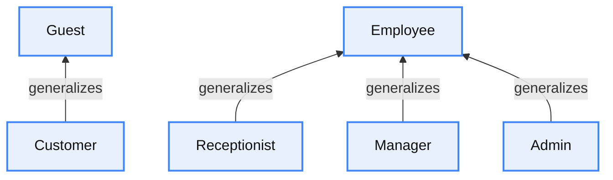
```mermaid
graph BT
    Customer -->|generalizes| Guest
    Receptionist -->|generalizes| Employee
    Manager -->|generalizes| Employee
    Admin -->|generalizes| Employee

    classDef a fill:#e8f0fe,stroke:#4285f4,stroke-width:2px,color:#111
    class Guest,Customer,Employee,Receptionist,Manager,Admin a
```

An actor that generalizes another inherits all of its use cases. `Receptionist` therefore
participates in `Login`, `View Personal Profile`, `Submit Leave Request` and every other
`Employee` use case in addition to the front-desk ones.

---

## 3. Use Case Model — Complete Inventory

All 124 use cases from the six use case diagrams. Column **Rel.** gives the relationship to the
base use case: `base` = directly associated with the actor, `«include»` = always executed as part
of the base, `«extend»` = conditionally extends the base.

### 3.1 Guest (UC-G)

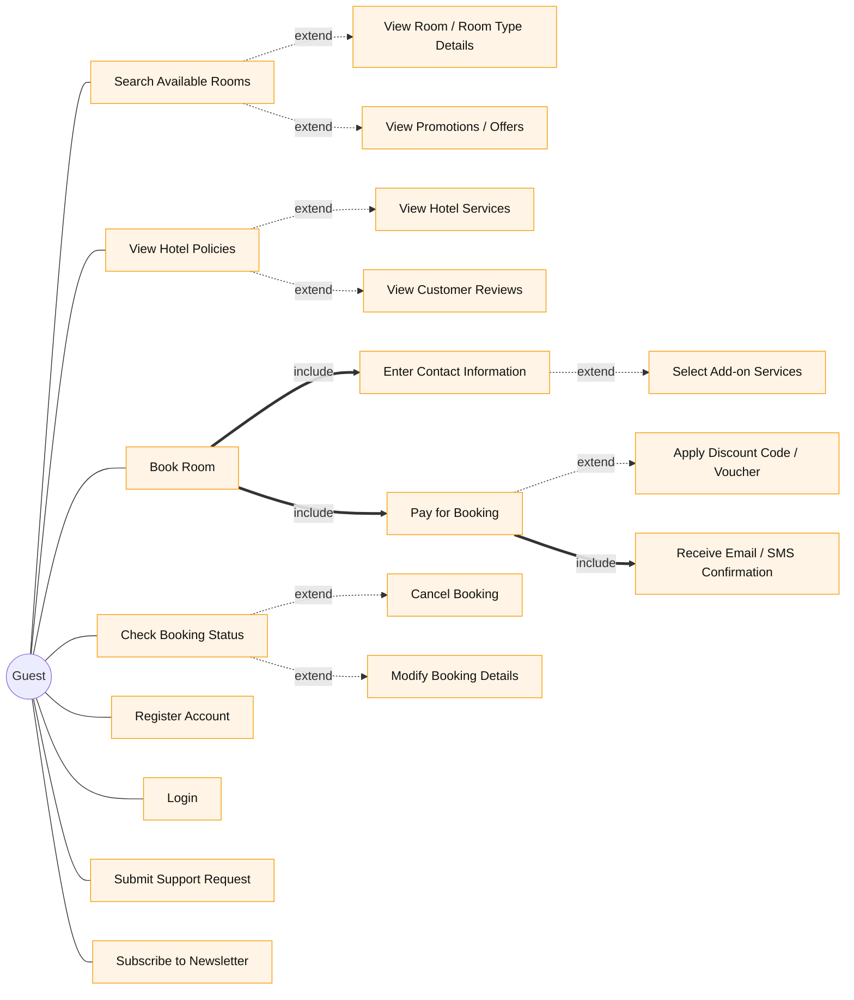
```mermaid
graph LR
    G((Guest))
    G --- G01[Search Available Rooms]
    G --- G04[View Hotel Policies]
    G --- G07[Book Room]
    G --- G13[Check Booking Status]
    G --- G16[Register Account]
    G --- G17[Login]
    G --- G18[Submit Support Request]
    G --- G19[Subscribe to Newsletter]
    G01 -.->|extend| G02[View Room / Room Type Details]
    G01 -.->|extend| G06[View Promotions / Offers]
    G04 -.->|extend| G03[View Hotel Services]
    G04 -.->|extend| G05[View Customer Reviews]
    G07 ==>|include| G08[Enter Contact Information]
    G07 ==>|include| G10[Pay for Booking]
    G08 -.->|extend| G09[Select Add-on Services]
    G10 -.->|extend| G11[Apply Discount Code / Voucher]
    G10 ==>|include| G12[Receive Email / SMS Confirmation]
    G13 -.->|extend| G14[Cancel Booking]
    G13 -.->|extend| G15[Modify Booking Details]
    classDef uc fill:#fff4e5,stroke:#f59e0b,color:#111
    class G01,G02,G03,G04,G05,G06,G07,G08,G09,G10,G11,G12,G13,G14,G15,G16,G17,G18,G19 uc
```

| ID | Use Case | Rel. | Summary | Priority |
|---|---|---|---|---|
| UC-G01 | Search Available Rooms | base | Search rooms by date range, occupancy, room type and price. | High |
| UC-G02 | View Room / Room Type Details | «extend» | View photos, amenities, capacity and rate of a room type. | High |
| UC-G03 | View Hotel Services | «extend» | Browse spa, restaurant, shuttle and other add-on services. | Medium |
| UC-G04 | View Hotel Policies | base | Read check-in/out times, cancellation, pet and smoking policies. | Medium |
| UC-G05 | View Customer Reviews | «extend» | Read published reviews and aggregate rating. | Medium |
| UC-G06 | View Promotions / Offers | «extend» | See the promotion codes the hotel lists publicly, with their terms (private codes are never listed). | Medium |
| UC-G07 | **Book Room** | base | Reserve one or more rooms (up to 5, any mix of types) for the same dates in one payment. | **High** |
| UC-G08 | Enter Contact Information | «include» | Supply guest name, email, phone and special requests. | High |
| UC-G09 | Select Add-on Services | «extend» | Add breakfast, airport pickup, spa to the booking. | Medium |
| UC-G10 | **Pay for Booking** | «include» | Pay deposit or full amount via the payment gateway. | **High** |
| UC-G11 | Apply Discount Code / Voucher | «extend» | Enter a promotion code; the system checks it and shows the discount and new total before payment. | Medium |
| UC-G12 | Receive Email / SMS Confirmation | «include» | Receive booking confirmation with reference code. | High |
| UC-G13 | Check Booking Status | base | Look up a reservation by code and email. | High |
| UC-G14 | Cancel Booking | «extend» | Cancel a reservation subject to the cancellation policy. | High |
| UC-G15 | Modify Booking Details | «extend» | Change dates, occupancy or room type of a reservation. | Medium |
| UC-G16 | Register Account | base | Create a customer account, becoming a Customer. | High |
| UC-G17 | Login | base | Authenticate with username and password. | High |
| UC-G18 | Submit Support Request / Contact Us | base | Send an inquiry or complaint to the hotel. | Low |
| UC-G19 | Subscribe to Newsletter / Promotions | base | Opt in to marketing email/SMS. | Low |

### 3.2 Customer (UC-C)

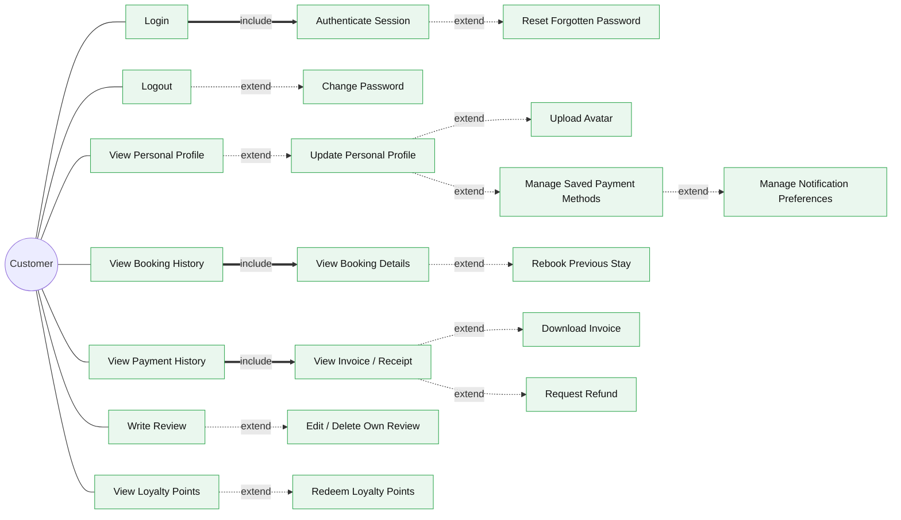
```mermaid
graph LR
    C((Customer))
    C --- C01[Login]
    C --- C04[Logout]
    C --- C06[View Personal Profile]
    C --- C11[View Booking History]
    C --- C14[View Payment History]
    C --- C18[Write Review]
    C --- C20[View Loyalty Points]
    C01 ==>|include| C02[Authenticate Session]
    C02 -.->|extend| C03[Reset Forgotten Password]
    C04 -.->|extend| C05[Change Password]
    C06 -.->|extend| C07[Update Personal Profile]
    C07 -.->|extend| C08[Upload Avatar]
    C07 -.->|extend| C09[Manage Saved Payment Methods]
    C09 -.->|extend| C10[Manage Notification Preferences]
    C11 ==>|include| C12[View Booking Details]
    C12 -.->|extend| C13[Rebook Previous Stay]
    C14 ==>|include| C15[View Invoice / Receipt]
    C15 -.->|extend| C16[Download Invoice]
    C15 -.->|extend| C17[Request Refund]
    C18 -.->|extend| C19[Edit / Delete Own Review]
    C20 -.->|extend| C21[Redeem Loyalty Points]
    classDef uc fill:#eaf7ee,stroke:#34a853,color:#111
    class C01,C02,C03,C04,C05,C06,C07,C08,C09,C10,C11,C12,C13,C14,C15,C16,C17,C18,C19,C20,C21 uc
```

| ID | Use Case | Rel. | Summary | Priority |
|---|---|---|---|---|
| UC-C01 | **Login** | base | Authenticate and open a session. | **High** |
| UC-C02 | Authenticate Session | «include» | Validate credentials and issue access/refresh tokens. | High |
| UC-C03 | Reset Forgotten Password | «extend» | Request an OTP by email/SMS and set a new password. | High |
| UC-C04 | Logout | base | Terminate the session and revoke the refresh token. | Medium |
| UC-C05 | Change Password | «extend» | Replace the current password with a new one. | Medium |
| UC-C06 | View Personal Profile | base | Display stored personal information. | Medium |
| UC-C07 | Update Personal Profile | «extend» | Edit name, phone, address, date of birth. | Medium |
| UC-C08 | Upload Avatar | «extend» | Upload a profile picture. | Low |
| UC-C09 | Manage Saved Payment Methods | «extend» | Add or remove tokenized cards. | Medium |
| UC-C10 | Manage Notification Preferences | «extend» | Choose which notifications to receive and by which channel. | Low |
| UC-C11 | View Booking History | base | List all past and upcoming reservations. | High |
| UC-C12 | View Booking Details | «include» | Show full detail of one reservation. | High |
| UC-C13 | Rebook Previous Stay | «extend» | Create a new booking pre-filled from a past stay. | Low |
| UC-C14 | View Payment History | base | List all payment transactions. | Medium |
| UC-C15 | View Invoice / Receipt | «include» | Display the invoice for a stay. | Medium |
| UC-C16 | Download Invoice | «extend» | Export the invoice as PDF. | Medium |
| UC-C17 | **Request Refund** | «extend» | Submit a refund request for a cancelled or disputed charge. | **High** |
| UC-C18 | Write Review | base | Publish a rating and comment for a completed stay. | Medium |
| UC-C19 | Edit / Delete Own Review | «extend» | Modify or remove a previously published review. | Low |
| UC-C20 | View Loyalty Points / Membership | base | Show point balance and membership tier. | Medium |
| UC-C21 | Redeem Loyalty Points | «extend» | Convert points into a discount voucher. | Medium |

### 3.3 Employee (UC-E)

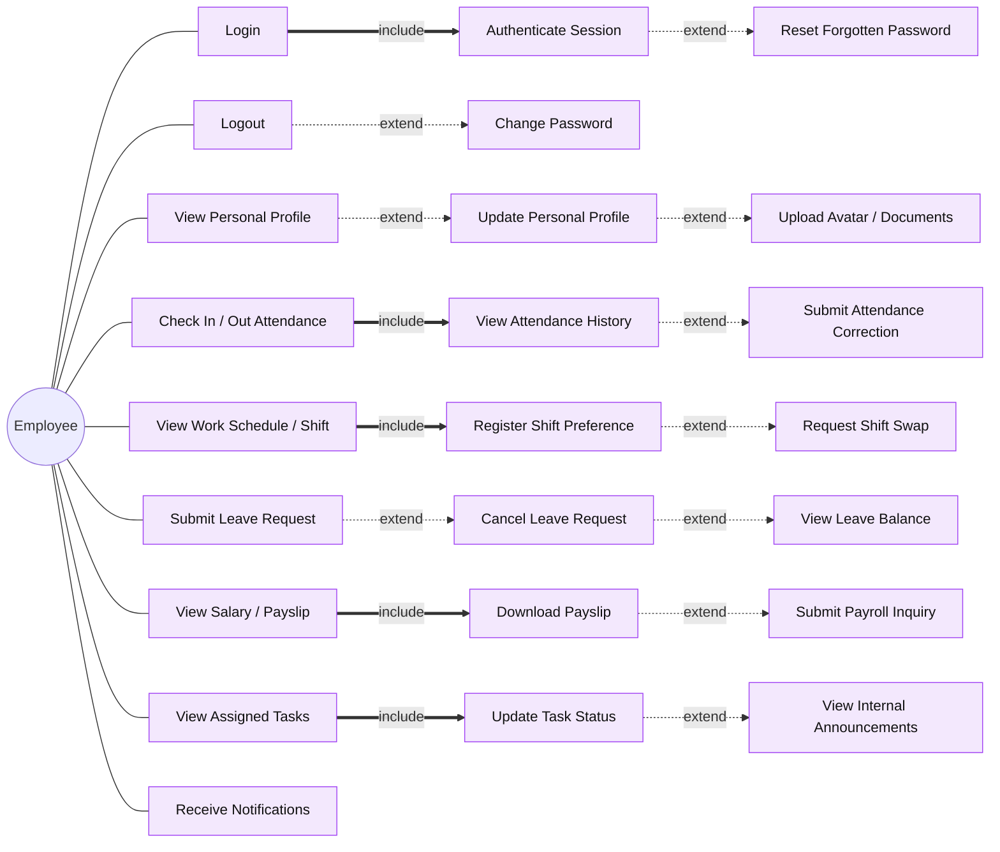
```mermaid
graph LR
    E((Employee))
    E --- E01[Login]
    E --- E04[Logout]
    E --- E06[View Personal Profile]
    E --- E09[Check In / Out Attendance]
    E --- E12[View Work Schedule / Shift]
    E --- E15[Submit Leave Request]
    E --- E18[View Salary / Payslip]
    E --- E21[View Assigned Tasks]
    E --- E24[Receive Notifications]
    E01 ==>|include| E02[Authenticate Session]
    E02 -.->|extend| E03[Reset Forgotten Password]
    E04 -.->|extend| E05[Change Password]
    E06 -.->|extend| E07[Update Personal Profile]
    E07 -.->|extend| E08[Upload Avatar / Documents]
    E09 ==>|include| E10[View Attendance History]
    E10 -.->|extend| E11[Submit Attendance Correction]
    E12 ==>|include| E13[Register Shift Preference]
    E13 -.->|extend| E14[Request Shift Swap]
    E15 -.->|extend| E16[Cancel Leave Request]
    E16 -.->|extend| E17[View Leave Balance]
    E18 ==>|include| E19[Download Payslip]
    E19 -.->|extend| E20[Submit Payroll Inquiry]
    E21 ==>|include| E22[Update Task Status]
    E22 -.->|extend| E23[View Internal Announcements]
    classDef uc fill:#f3e8fd,stroke:#a142f4,color:#111
    class E01,E02,E03,E04,E05,E06,E07,E08,E09,E10,E11,E12,E13,E14,E15,E16,E17,E18,E19,E20,E21,E22,E23,E24 uc
```

| ID | Use Case | Rel. | Summary | Priority |
|---|---|---|---|---|
| UC-E01 | Login | base | Staff authentication into the internal portal. | High |
| UC-E02 | Authenticate Session | «include» | Validate staff credentials, issue tokens with role claims. | High |
| UC-E03 | Reset Forgotten Password | «extend» | OTP-based staff password reset. | Medium |
| UC-E04 | Logout | base | End the staff session. | Medium |
| UC-E05 | Change Password | «extend» | Staff-initiated password change. | Medium |
| UC-E06 | View Personal Profile | base | View own employee record. | Low |
| UC-E07 | Update Personal Profile | «extend» | Edit own contact details. | Low |
| UC-E08 | Upload Avatar / Documents | «extend» | Upload photo, ID scan, certificates. | Low |
| UC-E09 | **Check In / Check Out Attendance** | base | Record shift start and end times. | **High** |
| UC-E10 | View Attendance History | «include» | List attendance records for a period. | Medium |
| UC-E11 | Submit Attendance Correction Request | «extend» | Request correction of a wrong attendance record. | Medium |
| UC-E12 | View Work Schedule / Shift | base | View the assigned shift roster. | High |
| UC-E13 | Register Shift Preference | «include» | Declare preferred shifts for the next period. | Medium |
| UC-E14 | Request Shift Swap | «extend» | Ask a colleague to exchange shifts. | Medium |
| UC-E15 | **Submit Leave Request** | base | Apply for annual, sick or unpaid leave. | **High** |
| UC-E16 | Cancel Leave Request | «extend» | Withdraw a pending leave request. | Medium |
| UC-E17 | View Leave Balance | «extend» | Show remaining leave days by type. | Medium |
| UC-E18 | View Salary / Payslip | base | View monthly payslip breakdown. | High |
| UC-E19 | Download Payslip | «include» | Export the payslip as PDF. | Medium |
| UC-E20 | Submit Payroll Inquiry | «extend» | Raise a question about a payslip item. | Low |
| UC-E21 | View Assigned Tasks | base | List housekeeping/maintenance tasks assigned. | High |
| UC-E22 | Update Task Status | «include» | Mark a task in-progress, done or blocked. | High |
| UC-E23 | View Internal Announcements | «extend» | Read hotel-wide announcements. | Low |
| UC-E24 | Receive Notifications | base | Receive push/email alerts for assignments and approvals. | Medium |

### 3.4 Receptionist (UC-R)

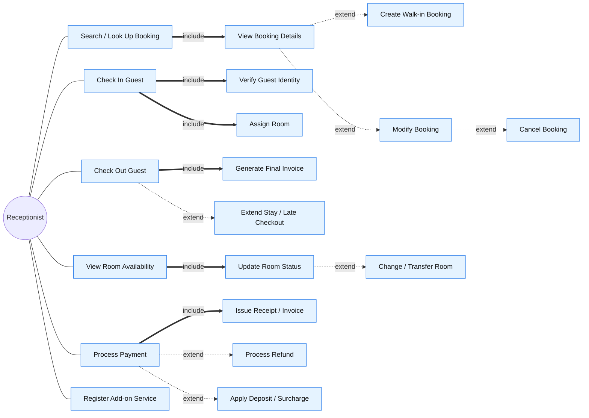
```mermaid
graph LR
    R((Receptionist))
    R --- R01[Search / Look Up Booking]
    R --- R06[Check In Guest]
    R --- R09[Check Out Guest]
    R --- R12[View Room Availability]
    R --- R15[Process Payment]
    R --- R19[Register Add-on Service]
    R01 ==>|include| R02[View Booking Details]
    R02 -.->|extend| R03[Create Walk-in Booking]
    R02 -.->|extend| R04[Modify Booking]
    R04 -.->|extend| R05[Cancel Booking]
    R06 ==>|include| R07[Verify Guest Identity]
    R06 ==>|include| R08[Assign Room]
    R09 ==>|include| R10[Generate Final Invoice]
    R09 -.->|extend| R11[Extend Stay / Late Checkout]
    R12 ==>|include| R13[Update Room Status]
    R13 -.->|extend| R14[Change / Transfer Room]
    R15 ==>|include| R16[Issue Receipt / Invoice]
    R15 -.->|extend| R17[Process Refund]
    R15 -.->|extend| R18[Apply Deposit / Surcharge]
    classDef uc fill:#e5f3ff,stroke:#1a73e8,color:#111
    class R01,R02,R03,R04,R05,R06,R07,R08,R09,R10,R11,R12,R13,R14,R15,R16,R17,R18,R19 uc
```

| ID | Use Case | Rel. | Summary | Priority |
|---|---|---|---|---|
| UC-R01 | Search / Look Up Booking | base | Find a booking by code, guest name, phone or date. | High |
| UC-R02 | View Booking Details | «include» | Show full reservation, guest and charge detail. | High |
| UC-R03 | **Create Walk-in Booking** | «extend» | Create a reservation for a guest at the desk. | **High** |
| UC-R04 | Modify Booking | «extend» | Change dates, room type or occupancy at the desk. | High |
| UC-R05 | Cancel Booking | «extend» | Cancel a reservation and compute the penalty. | High |
| UC-R06 | **Check In Guest** | base | Admit an arriving guest and activate the stay. | **High** |
| UC-R07 | Verify Guest Identity | «include» | Validate passport/ID against the reservation. | High |
| UC-R08 | Assign Room | «include» | Allocate a specific vacant-clean room. | High |
| UC-R09 | **Check Out Guest** | base | Settle the folio and release the room. | **High** |
| UC-R10 | Generate Final Invoice | «include» | Produce the final folio with all charges and taxes. | High |
| UC-R11 | Extend Stay / Late Checkout | «extend» | Prolong the stay or grant late checkout with surcharge. | Medium |
| UC-R12 | View Room Availability | base | Show the room rack by status and date. | High |
| UC-R13 | Update Room Status | «include» | Set room to clean, dirty, inspected or out-of-order. | High |
| UC-R14 | Change / Transfer Room | «extend» | Move an in-house guest to another room. | Medium |
| UC-R15 | **Process Payment** | base | Take cash or card payment against a folio. | **High** |
| UC-R16 | Issue Receipt / Invoice | «include» | Print or email the payment receipt. | High |
| UC-R17 | Process Refund | «extend» | Return money for a cancellation or overcharge. | High |
| UC-R18 | Apply Deposit / Surcharge | «extend» | Charge a security deposit or an incidental surcharge. | Medium |
| UC-R19 | Register Add-on Service for Guest | base | Post a spa/restaurant/laundry charge to the folio. | Medium |

### 3.5 Manager (UC-M)

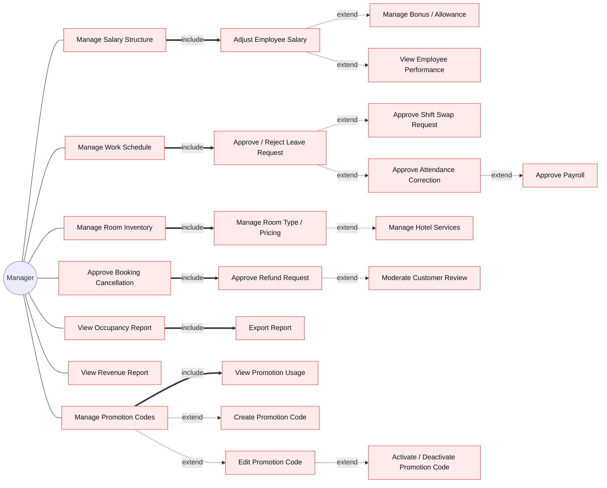
```mermaid
graph LR
    M((Manager))
    M --- M01[Manage Salary Structure]
    M --- M05[Manage Work Schedule]
    M --- M09[Manage Room Inventory]
    M --- M11[Manage Promotion Codes]
    M --- M13[Approve Booking Cancellation]
    M --- M16[View Revenue Report]
    M --- M17[View Occupancy Report]
    M01 ==>|include| M02[Adjust Employee Salary]
    M02 -.->|extend| M03[Manage Bonus / Allowance]
    M02 -.->|extend| M04[View Employee Performance]
    M05 ==>|include| M06[Approve / Reject Leave Request]
    M06 -.->|extend| M07[Approve Shift Swap Request]
    M06 -.->|extend| M08[Approve Attendance Correction]
    M08 -.->|extend| M08b[Approve Payroll]
    M09 ==>|include| M10[Manage Room Type / Pricing]
    M10 -.->|extend| M12[Manage Hotel Services]
    M13 ==>|include| M14[Approve Refund Request]
    M14 -.->|extend| M15[Moderate Customer Review]
    M17 ==>|include| M18[Export Report]
    M11 ==>|include| M19[View Promotion Usage]
    M11 -.->|extend| M20[Create Promotion Code]
    M11 -.->|extend| M21[Edit Promotion Code]
    M21 -.->|extend| M22[Activate / Deactivate Promotion Code]
    classDef uc fill:#fdeaea,stroke:#ea4335,color:#111
    class M01,M02,M03,M04,M05,M06,M07,M08,M08b,M09,M10,M11,M12,M13,M14,M15,M16,M17,M18,M19,M20,M21,M22 uc
```

| ID | Use Case | Rel. | Summary | Priority |
|---|---|---|---|---|
| UC-M01 | Manage Salary Structure | base | Define pay grades, base salary bands and allowance rules. | High |
| UC-M02 | Adjust Employee Salary | «include» | Change an individual employee's salary with effective date. | High |
| UC-M03 | Manage Bonus / Allowance | «extend» | Grant performance bonus or position allowance. | Medium |
| UC-M04 | View Employee Performance | «extend» | Review KPI, attendance rate and task completion. | Medium |
| UC-M05 | Manage Work Schedule | base | Build and publish the shift roster for a period. | High |
| UC-M06 | **Approve / Reject Leave Request** | «include» | Decide on pending leave applications. | **High** |
| UC-M07 | Approve Shift Swap Request | «extend» | Authorize a shift exchange between two employees. | Medium |
| UC-M08 | Approve Attendance Correction | «extend» | Accept or reject an attendance correction request. | Medium |
| UC-M08b | Approve Payroll | «extend» | Lock and approve the monthly payroll run. | High |
| UC-M09 | Manage Room Inventory | base | Add, retire and configure physical rooms. | High |
| UC-M10 | **Manage Room Type / Pricing** | «include» | Define room types, base rates and seasonal pricing. | **High** |
| UC-M11 | **Manage Promotion Codes** | base | List every promotion code with its status and usage; entry point to create, edit and switch codes on or off. | **High** |
| UC-M12 | Manage Hotel Services | «extend» | Configure add-on services and their prices. | Medium |
| UC-M13 | Approve Booking Cancellation | base | Authorize cancellations that exceed policy limits. | High |
| UC-M14 | **Approve Refund Request** | «include» | Approve or reject a customer refund request. | **High** |
| UC-M15 | Moderate Customer Review | «extend» | Publish, hide or reply to a customer review. | Medium |
| UC-M16 | View Revenue Report | base | Revenue by period, channel, room type; ADR and RevPAR. | High |
| UC-M17 | View Occupancy Report | base | Occupancy rate, arrivals, departures, forecast. | High |
| UC-M18 | Export Report | «include» | Export a report to Excel or PDF. | Medium |
| UC-M19 | View Promotion Usage | «include» | Uses against the limit, reservations, rooms, discount given and revenue per code. | High |
| UC-M20 | Create Promotion Code | «extend» | Define a code: discount, validity days, usage limit, minimum spend, public or private. | High |
| UC-M21 | Edit Promotion Code | «extend» | Change dates, limit, minimum spend, wording or visibility; the discount is fixed once used. | Medium |
| UC-M22 | Activate / Deactivate Promotion Code | «extend» | Switch a code off (refused at once for new bookings) or back on. | Medium |

### 3.6 Admin (UC-A)

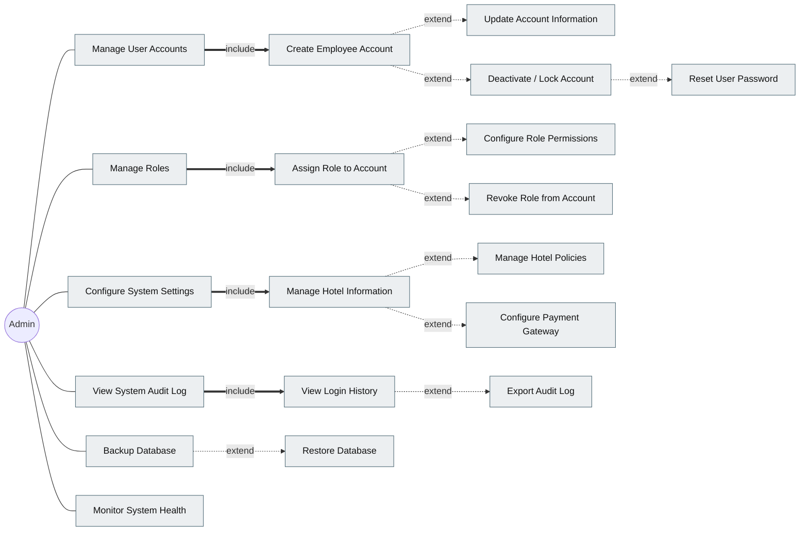
```mermaid
graph LR
    A((Admin))
    A --- A01[Manage User Accounts]
    A --- A05[Manage Roles]
    A --- A09[Configure System Settings]
    A --- A13[View System Audit Log]
    A --- A16[Backup Database]
    A --- A18[Monitor System Health]
    A01 ==>|include| A02[Create Employee Account]
    A02 -.->|extend| A03[Update Account Information]
    A02 -.->|extend| A04[Deactivate / Lock Account]
    A04 -.->|extend| A04b[Reset User Password]
    A05 ==>|include| A06[Assign Role to Account]
    A06 -.->|extend| A07[Configure Role Permissions]
    A06 -.->|extend| A08[Revoke Role from Account]
    A09 ==>|include| A10[Manage Hotel Information]
    A10 -.->|extend| A11[Manage Hotel Policies]
    A10 -.->|extend| A12[Configure Payment Gateway]
    A13 ==>|include| A14[View Login History]
    A14 -.->|extend| A15[Export Audit Log]
    A16 -.->|extend| A17[Restore Database]
    classDef uc fill:#eceff1,stroke:#546e7a,color:#111
    class A01,A02,A03,A04,A04b,A05,A06,A07,A08,A09,A10,A11,A12,A13,A14,A15,A16,A17,A18 uc
```

| ID | Use Case | Rel. | Summary | Priority |
|---|---|---|---|---|
| UC-A01 | Manage User Accounts | base | Central account administration entry point. | High |
| UC-A02 | **Create Employee Account** | «include» | Provision a new staff account with initial role. | **High** |
| UC-A03 | Update Account Information | «extend» | Modify account attributes and department. | Medium |
| UC-A04 | Deactivate / Lock Account | «extend» | Disable an account on termination or security event. | High |
| UC-A04b | Reset User Password | «extend» | Force-reset a user password administratively. | Medium |
| UC-A05 | Manage Roles | base | Define the role catalogue. | High |
| UC-A06 | **Assign Role to Account** | «include» | Grant a role to a user account. | **High** |
| UC-A07 | Configure Role Permissions | «extend» | Edit the permission set of a role. | High |
| UC-A08 | Revoke Role from Account | «extend» | Remove a role from an account. | High |
| UC-A09 | Configure System Settings | base | Global system configuration entry point. | Medium |
| UC-A10 | Manage Hotel Information | «include» | Maintain hotel name, address, contact, branding. | Medium |
| UC-A11 | Manage Hotel Policies | «extend» | Edit check-in/out, cancellation and deposit policies. | Medium |
| UC-A12 | Configure Payment Gateway | «extend» | Set gateway credentials, currency and modes. | High |
| UC-A13 | View System Audit Log | base | Inspect the immutable audit trail. | Medium |
| UC-A14 | View Login History | «include» | Review authentication attempts per account. | Medium |
| UC-A15 | Export Audit Log | «extend» | Export audit entries for compliance. | Low |
| UC-A16 | Backup Database | base | Trigger or schedule a database backup. | High |
| UC-A17 | Restore Database | «extend» | Restore the database from a backup set. | High |
| UC-A18 | Monitor System Health | base | View uptime, error rate, queue depth, resource usage. | Medium |

### 3.7 Use Case Count Summary

| Actor | Base | «include» | «extend» | Total |
|---|---|---|---|---|
| Guest | 8 | 4 | 7 | 19 |
| Customer | 7 | 4 | 10 | 21 |
| Employee | 9 | 5 | 10 | 24 |
| Receptionist | 6 | 7 | 6 | 19 |
| Manager | 7 | 6 | 9 | 22 |
| Admin | 6 | 4 | 9 | 19 |
| **Total** | **43** | **30** | **51** | **124** |

---

## 4. Detailed Use Case Specifications

The thirteen highest-priority use cases below are specified in full. They were selected because
they carry the core business value (booking → payment → check-in → check-out → invoice),
the critical control flows (authentication, approval workflows) and the highest architectural
risk (concurrency on room allocation, external gateway integration).

| # | ID | Use Case | Primary Actor | Why detailed |
|---|---|---|---|---|
| 1 | UC-G17 | Login | Guest / Customer / Employee | Gateway to every authenticated use case |
| 2 | UC-G16 | Register Account | Guest | Creates the Customer actor |
| 3 | UC-G01 | Search Available Rooms | Guest | Highest-traffic read path |
| 4 | UC-G07 | Book Room | Guest | Core revenue transaction |
| 5 | UC-G10 | Pay for Booking | Guest | External gateway, money-critical |
| 6 | UC-G14 | Cancel Booking | Guest / Customer | Policy + refund chain |
| 7 | UC-R06 | Check In Guest | Receptionist | Concurrency on room allocation |
| 8 | UC-R09 | Check Out Guest | Receptionist | Folio settlement |
| 9 | UC-R15 | Process Payment | Receptionist | Front-desk money handling |
| 10 | UC-C17 | Request Refund | Customer | Multi-step approval workflow |
| 11 | UC-M06 | Approve / Reject Leave Request | Manager | Representative HR workflow |
| 12 | UC-A06 | Assign Role to Account | Admin | Security-critical RBAC |
| 13 | UC-M11 | Manage Promotion Codes | Manager | Gives money away; its rules are shared with booking |

---

### UC-G17 — Login

| Field | Value |
|---|---|
| **ID and Name** | UC-G17 — Login |
| **Created By** | System Design Team |
| **Date Created** | 22/09/2026 |
| **Primary Actor** | Guest (becoming Customer), Employee |
| **Secondary Actors** | Email / SMS Service |
| **Trigger** | The user clicks the **Login** button and submits credentials. |

**Description**
Allows a registered user (Customer or Employee) to authenticate with the HMS using a valid
username/email and password, receiving a session token whose role claims determine the
functions available to them.

**Preconditions**
- PRE-1: The user has a registered account in the system.
- PRE-2: The account status is `ACTIVE` (not locked or deactivated).

**Postconditions**
- POST-1: The user is authenticated; an access token and refresh token are issued.
- POST-2: The user is redirected to the landing page matching their role.
- POST-3: A login record is written to the audit log.

**Normal Flow — 1.0: Login with username and password**
1. The user opens the login page.
2. The system displays the login form (username/email, password).
3. The user enters valid credentials.
4. The user clicks **Login**.
5. The system validates that both fields are non-empty.
6. The system looks up the account and verifies the password hash. *(«include» UC-C02 Authenticate Session)*
7. The system checks that the account is active and not locked.
8. The system issues an access token (15 min) and a refresh token (7 days).
9. The system resets the failed-attempt counter and records the login in the audit log.
10. The system redirects the user to the role-appropriate dashboard.

**Alternative Flows**
- **1.1: Login with Google (OAuth)**
  1. The user clicks **Login with Google**.
  2. The system redirects to the Google consent screen.
  3. The user authorizes the application.
  4. The system receives the profile; if no local account exists it creates one and links it.
  5. Continue from step 8 of the Normal Flow.
- **1.2: Forgotten password** — *(«extend» UC-C03 Reset Forgotten Password)*
  1. The user clicks **Forgot password**.
  2. The system sends an OTP via the Email/SMS Service.
  3. The user submits the OTP and a new password.
  4. The system updates the password hash and returns to step 2 of the Normal Flow.

**Exceptions**
- **1.0.E1 — Empty field:** "Username and password must not be empty." Return to step 3.
- **1.0.E2 — Account not found:** "Invalid username or password." Return to step 3. *(The message is deliberately generic to prevent account enumeration.)*
- **1.0.E3 — Wrong password:** Increment the failed counter, show "Invalid username or password." Return to step 3.
- **1.0.E4 — Account locked after 5 failures:** Set status `LOCKED`, notify the user by email, show "Account locked. Contact the administrator." Terminate.
- **1.0.E5 — Account deactivated:** "This account has been deactivated." Terminate.
- **1.0.E6 — Email not verified:** the credentials are correct but the account is still `PENDING_VERIFICATION` (PRE-2). "Please verify your email address before signing in." Offer to resend the link. *(Checked only after the password is proven, so the status is never revealed to someone without the credentials.)*

| Field | Value |
|---|---|
| **Priority** | High |
| **Frequency of Use** | Every session; several hundred per day. |
| **Business Rules** | BR-01 Password ≥ 8 chars with upper, lower, digit. BR-02 Lock after 5 consecutive failures. BR-03 Access token 15 min, refresh token 7 days. |
| **Non-functional** | Response ≤ 1 s at 200 concurrent logins; passwords hashed with bcrypt cost ≥ 10; TLS mandatory. |
| **Assumptions** | The user has network access; the email/SMS provider is available for OTP. |

---

### UC-G16 — Register Account

| Field | Value |
|---|---|
| **ID and Name** | UC-G16 — Register Account |
| **Primary Actor** | Guest |
| **Secondary Actors** | Email / SMS Service |
| **Trigger** | The Guest clicks **Sign up** and submits the registration form. |

**Description**
Allows an unregistered Guest to create a Customer account, after which they gain access to
profile, booking history, invoice, review and loyalty features.

**Preconditions**
- PRE-1: The email address is not already registered.

**Postconditions**
- POST-1: A new account is created with status `PENDING_VERIFICATION` and role `CUSTOMER`.
- POST-2: A verification email is sent.
- POST-3: After verification the status becomes `ACTIVE` and a loyalty account is opened with 0 points.

**Normal Flow — 1.0: Self-registration**
1. The Guest opens the registration page.
2. The system displays the form: full name, email, phone, password, confirm password.
3. The Guest fills the form and accepts the terms of service.
4. The Guest clicks **Register**.
5. The system validates format, password strength and password match.
6. The system checks that the email and phone are not already in use.
7. The system hashes the password and creates the account with status `PENDING_VERIFICATION`.
8. The system creates a linked loyalty account with a zero balance.
9. The system sends a verification link valid for 24 hours.
10. The system shows "Please check your email to verify your account."
11. The Guest clicks the link; the system sets the status to `ACTIVE` and redirects to login.

**Alternative Flows**
- **1.1: Registration during checkout** — the Guest ticks "Create an account" on the booking form; the system reuses the contact data already entered and continues from step 5.
- **1.2: Social sign-up** — the Guest registers via Google; the email is treated as verified and the status is set directly to `ACTIVE`.

**Exceptions**
- **1.0.E1 — Email already registered:** "This email is already in use. Log in instead?" Return to step 3.
- **1.0.E2 — Weak password:** Show the strength rule that failed. Return to step 3.
- **1.0.E3 — Passwords do not match:** "Passwords do not match." Return to step 3.
- **1.0.E4 — Verification link expired:** Offer to resend; a new link is generated.

| Field | Value |
|---|---|
| **Priority** | High |
| **Frequency of Use** | Tens per day. |
| **Business Rules** | BR-04 One account per email. BR-05 Verification link valid 24 h. BR-06 Terms must be accepted. |
| **Non-functional** | Verification email delivered within 60 s. |

---

### UC-G01 — Search Available Rooms

| Field | Value |
|---|---|
| **ID and Name** | UC-G01 — Search Available Rooms |
| **Primary Actor** | Guest |
| **Secondary Actors** | — |
| **Trigger** | The Guest submits the search form with dates and occupancy. |

**Description**
Lets a Guest find room types that are available for a given date range and occupancy, with
live prices reflecting the applicable seasonal rate and active promotions.

**Preconditions**
- PRE-1: Room types and rate plans are configured (UC-M10).

**Postconditions**
- POST-1: A list of available room types with prices is displayed.
- POST-2: No system state is changed (read-only use case).

**Normal Flow — 1.0: Search by date and occupancy**
1. The Guest opens the home or search page.
2. The system displays the search form: check-in date, check-out date, adults, children, room count.
3. The Guest enters the criteria and clicks **Search**.
4. The system validates that check-in ≥ today and check-out > check-in.
5. The system computes, for each room type, `availableCount = totalRooms − confirmedOverlappingBookings − blockedRooms`.
6. The system filters out room types whose `availableCount` is 0 or whose capacity is below the requested occupancy.
7. The system computes the price per room type for the stay, applying the seasonal rate for each night.
8. Before a search, the system lists the promotion codes currently offered to everyone, with their terms. *(«extend» UC-G06)* Codes are never applied automatically: the Guest enters one when booking (UC-G11).
9. The system displays the result list sorted by price, with photos, capacity, amenities and total price.

**Alternative Flows**
- **1.1: Refine with filters** — the Guest applies price range, bed type, view or amenity filters; the system re-filters the current result set without another availability computation.
- **1.2: View details** — *(«extend» UC-G02)* the Guest clicks a room type and the system shows the full gallery, amenity list, policy and review summary.
- **1.3: Flexible dates** — the Guest selects "± 3 days"; the system returns an availability calendar for the surrounding window.

**Exceptions**
- **1.0.E1 — Check-in in the past:** "Check-in date cannot be in the past." Return to step 3.
- **1.0.E2 — Check-out not after check-in:** "Check-out must be after check-in." Return to step 3.
- **1.0.E3 — Stay exceeds 30 nights:** "For stays longer than 30 nights please contact us." Return to step 3.
- **1.0.E4 — No availability:** "No rooms available for these dates." The system suggests the nearest available dates.

| Field | Value |
|---|---|
| **Priority** | High |
| **Frequency of Use** | Highest-volume use case; thousands per day. |
| **Business Rules** | BR-07 Max 30 nights per booking. BR-08 At most 5 rooms in one reservation. BR-09 Price = Σ nightly seasonal rate − promotion. The search lists every room type with a free room, not only those that sleep the whole party — a party of six may take three doubles; types that fit the party in one room are listed first. |
| **Non-functional** | Response ≤ 2 s for a 30-day window; availability results cached 60 s; must handle 500 concurrent searches. |

---

### UC-G07 — Book Room

| Field | Value |
|---|---|
| **ID and Name** | UC-G07 — Book Room |
| **Primary Actor** | Guest (or Customer) |
| **Secondary Actors** | Payment Gateway (payOS), Email / SMS Service |
| **Trigger** | The Guest chooses one or more rooms on the search results and clicks **Continue** (or **Book one room**). |

**Description**
Reserves one or more rooms for the same dates in a single transaction — a couple takes one
room, a family of seven a suite and two doubles. The Guest gives their contact details and says
who sleeps in which room; the rooms are paid together with one payOS payment and confirmed
together. This is the central revenue-producing use case of the system.

A booking of several rooms is a **reservation**: one `Booking` per room, sharing a
`reservationCode`, the dates and one payOS payment. Each room keeps its own lifecycle — rooms of
the same family may arrive at different times, and one room can be cancelled while the others
stay (see §5.4).

**Preconditions**
- PRE-1: Every chosen room type has enough free rooms for the dates (UC-G01).
- PRE-2: The Guest has completed a search and chosen at least one room.

**Postconditions**
- POST-1: One `Booking` per room exists with status `CONFIRMED`, all sharing a reservation code; each room has its own booking code (`<reservation>-1`, `-2`, …; a single room's code equals the reservation code).
- POST-2: Room inventory is decremented by one room per booking.
- POST-3: One `Payment` per room exists with status `PAID`, all carrying the same payOS order code.
- POST-4: One confirmation email lists every room of the reservation.
- POST-5: If the actor is a Customer, every room is linked to their account; loyalty points are credited later, per room, on check-out (BR-29).

**Normal Flow — 1.0: Book one or more rooms, pay online**
1. On the search results the Guest sets how many rooms of each type they want. The system keeps a running total and checks that the rooms sleep the whole party and number at most five (BR-08).
2. The Guest continues. The system shows the contact form. *(«include» UC-G08 Enter Contact Information)*
3. The Guest enters full name, email, phone and any special request.
4. The system spreads the party over the rooms — one adult per room first, then the rest wherever there is a bed — and shows it. The Guest may change who sleeps where, and may name the person staying in each room if it is not themselves.
5. The system optionally offers add-on services per room. *(«extend» UC-G09 Select Add-on Services)*
6. The system displays the summary: dates, nights, every room with its guests and price, taxes, total.
7. The Guest may enter a voucher code, or pick one of the listed offers, and apply it. The system checks it — active, within its days, not used up, minimum spend met — and shows the discount and the new total before payment. *(«extend» UC-G11 Apply Discount Code / Voucher)*
8. The Guest confirms. The system re-verifies availability and **holds every room** for 15 minutes — all or nothing: if any room cannot be held, the rooms already held are released.
9. The system prices each room, spreads the voucher discount over the rooms in proportion to their price, and records one `PENDING` booking per room under a new reservation code.
10. The system creates **one** payOS payment link for the total, with one line per room, and one `PENDING` payment per room carrying its order code. *(«include» UC-G10 Pay for Booking)*
11. The Guest pays once, by scanning the VietQR.
12. On confirmation from payOS the system confirms every room (`PENDING → CONFIRMED`, §6.4), commits the inventory and releases the holds.
13. The system sends one confirmation listing every room *(«include» UC-G12)* and counts one use of the voucher.
14. The system displays the confirmation with the reservation code.

**Alternative Flows**
- **1.1: Pay at hotel** — the Guest reserves with a card guarantee and pays on arrival. *(Specified, not yet implemented: every booking is prepaid through payOS.)*
- **1.2: Booking as a logged-in Customer** — the contact form is pre-filled from the profile and every room is linked to the Customer's account. Loyalty points (1 % of room revenue, BR-12) are credited only when each stay completes (BR-29) — crediting at booking time would let a guest book, collect points and cancel.
- **1.3: One room** — a room type that sleeps the whole party offers **Book one room**, which skips the selection bar; the flow is otherwise identical with a reservation of one room.

**Exceptions**
- **1.0.E1 — Not enough rooms left:** at step 8 a room cannot be held because others were booked meanwhile. "Only N {type} rooms left for these dates — you asked for M." Nothing is held, booked or charged. Return to UC-G01 with the criteria preserved.
- **1.0.E2 — Hold expired (15 min):** "The hold has ended. Search again." The payOS link closes a minute before the holds, so the Guest cannot pay for released rooms.
- **1.0.E3 — Payment declined or cancelled:** *(see UC-G10)* every room moves `PENDING → CANCELLED` and its hold is released; the Guest may retry. On a gateway timeout the rooms stay `PENDING` with their holds until payOS confirms or fails the payment.
- **1.0.E4 — A room over capacity or without an adult:** "Room 2 (Standard Double) sleeps at most 2." / "Room 3 needs at least one adult." Return to step 4.
- **1.0.E5 — More than five rooms:** "At most 5 rooms can be booked together — for a group, please contact the hotel." (BR-08)
- **1.0.E6 — Confirmation delivery failure:** the reservation remains valid; the system queues a retry and shows the reservation code on screen.
- **1.0.E7 — Voucher refused:** at step 7, or again at step 8 because a code can be used up or switched off meanwhile. The reason is given — "This voucher has reached its usage limit", "This voucher applies to bookings of 3.000.000 ₫ or more, before tax" — and nothing is held or charged. The Guest removes the code or tries another (rules BR-52…BR-57, UC-M11).

| Field | Value |
|---|---|
| **Priority** | High |
| **Frequency of Use** | The primary revenue transaction; dozens to hundreds per day. |
| **Business Rules** | BR-08 At most 5 rooms per reservation, all for the same dates. BR-10 Holds expire after 15 min. BR-11 Code format `HMS-YYYYMMDD-XXXXX`; rooms of a multi-room reservation add `-1`, `-2`, …. BR-12 Loyalty accrual 1 % of room revenue for Customers, credited per room on check-out (BR-29). BR-13 Each room's occupancy must not exceed its capacity, and each room needs an adult. BR-51 A voucher applies to the whole reservation: its discount is spread over the rooms in proportion to their price, and it counts as **one** use, when the payment is confirmed. |
| **Non-functional** | Holding the rooms is all-or-nothing, so a failed reservation never leaves rooms locked. Confirming a multi-room payment is exactly-once per room and sends exactly one email, even when payOS's webhook and the returning guest arrive together (verified by test: without the guard, ten concurrent confirmations sent ten emails). End-to-end ≤ 5 s excluding gateway latency. |
| **Assumptions** | payOS is reachable; rates and taxes are configured. |

---

### UC-G10 — Pay for Booking

| Field | Value |
|---|---|
| **ID and Name** | UC-G10 — Pay for Booking |
| **Primary Actor** | Guest (or Customer) |
| **Secondary Actors** | Payment Gateway — **payOS** (VietQR / bank transfer, https://payos.vn) |
| **Trigger** | Included from UC-G07 step 9. |

**Description**
Collects payment for a booking through payOS and records the resulting transaction,
guaranteeing that the booking is only confirmed when the money has actually arrived.
payOS is **asynchronous**: the guest pays from their own banking app by scanning a VietQR,
and payOS reports the result afterwards. A payment is therefore never approved in the same
request that creates it.

**Preconditions**
- PRE-1: A `PENDING` booking exists with a computed payable amount > 0 (UC-G07 step 9).
- PRE-2: payOS credentials are configured and the webhook URL is registered (UC-A12).

**Postconditions**
- POST-1: One `Payment` record per room exists with status `PAID`, `FAILED` or `PENDING`; the rooms of one reservation all carry the same integer payOS `orderCode`.
- POST-2: On success the bank transfer reference is stored and the booking moves `PENDING → CONFIRMED`.
- POST-3: On failure, cancellation or expiry the booking moves `PENDING → CANCELLED` and the inventory hold is released.

**Normal Flow — 1.0: VietQR payment via payOS**
1. The system displays the amount due.
2. The Guest may apply a voucher. *(«extend» UC-G11)* The system revalidates the code and recomputes the amount.
3. The system creates one `Payment` record per room with status `PENDING` and an idempotency key, all sharing a new payOS `orderCode` — **before** calling payOS, so a timeout still leaves records to reconcile against. Keeping one payment per room keeps refunds, folios and invoices per room.
4. The system creates **one** payOS payment link for the reservation's total, with one item per room, signed with HMAC-SHA256, a bank memo of at most 9 characters and an expiry one minute before the 15-minute inventory holds.
5. The system redirects the Guest to the payOS checkout page.
6. The Guest scans the VietQR with a banking app and transfers the money.
7. payOS sends a signed webhook to the system.
8. The system verifies the webhook signature and checks that the amount received equals the amount due.
9. The system checks the amount against the sum of the rooms, atomically sets each room's `Payment` to `PAID` (exactly once), stores the bank reference, confirms every room, and sends one confirmation for the reservation.
10. payOS redirects the Guest to the result page, which shows the confirmation.

**Alternative Flows**
- **1.1: Webhook not received** (e.g. a development machine that payOS cannot reach, or a lost delivery) — when the Guest reaches the result page, the system asks payOS server-to-server for the link status and applies it (steps 8–9). The status in the return URL's query string is **never trusted**, because anyone can type it.
- **1.2: Webhook and returning Guest arrive together** — both paths converge on one conditional atomic update; only one applies, so the money is booked once. *(Verified by test: without the guard, ten concurrent confirmations booked the payment ten times.)*
- **1.3: Guest cancels on the payOS page** — the Guest is sent to the cancel URL; the system reads the link status `CANCELLED` and moves the booking to `CANCELLED`, releasing the room.
- **1.4: Front-desk payment (UC-R15)** — the same link is created at the desk; the Receptionist shows its VietQR; the folio balance falls when the webhook arrives.

**Exceptions**
- **1.0.E1 — payOS refuses to create the link:** the `Payment` becomes `FAILED`, the booking `CANCELLED`, the hold is released; "Payment could not be started." The Guest may retry.
- **1.0.E2 — Transfer of the wrong amount (`UNDERPAID`):** the payment is **not** confirmed automatically; it stays `PENDING` and an audit entry `PAYMENT_AMOUNT_MISMATCH` is raised for staff to resolve.
- **1.0.E3 — payOS timeout while creating the link:** the `Payment` stays `PENDING` with its `orderCode`; the webhook or the reconciler settles it. No second link can be created for the same payment, because payOS rejects a reused `orderCode`.
- **1.0.E4 — Invalid webhook signature:** the request is rejected with 400, nothing changes, and the attempt is logged. The webhook endpoint is public, so the signature is its only authentication.
- **1.0.E5 — Voucher no longer valid:** "This voucher has expired or reached its usage limit." Recompute without it and return to step 2.
- **1.0.E6 — Guest abandons the payOS page:** the link expires before the inventory hold and the room returns to inventory when the hold lapses. The `PENDING` payment is marked `FAILED` the next time it is reconciled. *(A periodic sweeper for never-reconciled links is future work.)*

| Field | Value |
|---|---|
| **Priority** | High |
| **Frequency of Use** | Once per booking. |
| **Business Rules** | BR-14 A booking is confirmed only after `PAID`. BR-15 Every payment carries an idempotency key and a payOS `orderCode` unique for all time. BR-16 Bank data never touches HMS servers — payOS hosts the checkout. BR-50 **payOS has no refund API**: refunds are made by manual bank transfer (UC-G14, UC-C17). |
| **Non-functional** | payOS calls time out at 30 s; signatures use HMAC-SHA256 with the checksum key and are checked byte-for-byte against the official `@payos/node` SDK; webhook signatures are compared in constant time; amounts are integer VND. |

---

### UC-G14 — Cancel Booking

| Field | Value |
|---|---|
| **ID and Name** | UC-G14 — Cancel Booking |
| **Primary Actor** | Guest / Customer |
| **Secondary Actors** | Manager (for out-of-policy cases), Payment Gateway, Email Service |
| **Trigger** | The user opens a booking and clicks **Cancel booking**. |

**Description**
Cancels a booked room, computes the cancellation penalty from the hotel policy, releases the
inventory and initiates any refund due. In a multi-room reservation each room is cancelled on
its own — the policy and the refund apply to that room's price, and the other rooms stay booked.

**Preconditions**
- PRE-1: The booking exists with status `CONFIRMED`.
- PRE-2: The booking has not yet been checked in.

**Postconditions**
- POST-1: The booking status becomes `CANCELLED` (or `PENDING_APPROVAL` when out of policy).
- POST-2: The room inventory for those dates is released.
- POST-3: A refund is initiated for the refundable portion, if any.
- POST-4: A cancellation notice is emailed to the guest.

**Normal Flow — 1.0: Cancel within the free-cancellation window**
1. The user opens the booking (UC-G13 / UC-C12) and clicks **Cancel booking**.
2. The system verifies that the booking is `CONFIRMED` and not yet checked in.
3. The system evaluates the cancellation policy against the current time and the check-in date.
4. The system computes the penalty and the refundable amount and displays them for confirmation.
5. The user confirms the cancellation and optionally selects a reason.
6. The system sets the booking status to `CANCELLED` and records the reason and timestamp.
7. The system releases the inventory for the affected dates.
8. The system initiates the refund through the gateway for the refundable amount.
9. The system sends the cancellation confirmation email.
10. The system displays the cancellation summary.

**Alternative Flows**
- **1.1: Cancellation outside the policy window** — when the penalty is 100 % or the check-in is within 24 h, the system creates a `RefundRequest` with status `PENDING` and routes it to the Manager. *(→ UC-M14 Approve Refund Request)* The booking is cancelled immediately but the refund waits for approval.
- **1.2: Non-refundable rate** — the system shows "This rate is non-refundable. No refund will be issued." and proceeds without a refund.
- **1.3: Cancellation by the Receptionist** — *(UC-R05)* the Receptionist cancels at the desk on the guest's behalf, with an override privilege to waive the penalty subject to Manager approval.

**Exceptions**
- **1.0.E1 — Booking already checked in:** "A booking that has been checked in cannot be cancelled. Please contact the front desk." Terminate.
- **1.0.E2 — Booking already cancelled:** "This booking has already been cancelled." Terminate.
- **1.0.E3 — Refund failure at the gateway:** the cancellation stands; the refund is queued for retry and the Admin is alerted.
- **1.0.E4 — Stay already in progress:** redirect to the early-departure procedure at the front desk.

| Field | Value |
|---|---|
| **Priority** | High |
| **Frequency of Use** | Roughly 10–15 % of bookings. |
| **Business Rules** | BR-17 Free cancellation ≥ 48 h before check-in. BR-18 50 % penalty between 48 h and 24 h. BR-19 100 % penalty inside 24 h. BR-20 Non-refundable rates are never auto-refunded. |
| **Non-functional** | The inventory release must be transactional with the status change; refunds initiated within 24 h and settled within 7 working days. |

---

### UC-R06 — Check In Guest

| Field | Value |
|---|---|
| **ID and Name** | UC-R06 — Check In Guest |
| **Primary Actor** | Receptionist |
| **Secondary Actors** | — |
| **Trigger** | A guest arrives at the front desk and presents a booking code or identity document. |

**Description**
Admits an arriving guest: verifies identity against the reservation, allocates a specific
vacant-clean room, collects any outstanding balance or deposit, and activates the stay so the
folio can receive charges.

**Preconditions**
- PRE-1: A booking exists with status `CONFIRMED` for today.
- PRE-2: The Receptionist is authenticated with the `CHECK_IN` permission.
- PRE-3: At least one room of the booked type is in status `VACANT_CLEAN`.

**Postconditions**
- POST-1: The booking status becomes `CHECKED_IN` with the actual arrival time recorded.
- POST-2: A specific room is allocated and its status becomes `OCCUPIED`.
- POST-3: An open folio exists for the stay.
- POST-4: Guest identity details are recorded for legal registration.

**Normal Flow — 1.0: Standard check-in of a confirmed booking**
1. The Receptionist searches for the booking. *(«include» UC-R01 / UC-R02)*
2. The system displays the reservation: guest, room type, dates, occupancy, balance.
3. The Receptionist requests the guest's identity document.
4. The Receptionist records the document type, number and expiry, and matches the name against the reservation. *(«include» UC-R07 Verify Guest Identity)*
5. The system validates that the document is not expired and that the guest is of legal age.
6. The system lists the rooms of the booked type in status `VACANT_CLEAN`. *(«include» UC-R08 Assign Room)*
7. The Receptionist selects a room, honouring any preference (floor, view, quiet).
8. The system locks the selected room to prevent double allocation.
9. The system shows any outstanding balance and required deposit.
10. The Receptionist collects the balance and/or deposit. *(«include» UC-R15 Process Payment, «extend» UC-R18 Apply Deposit)*
11. The Receptionist confirms the check-in.
12. The system sets the booking to `CHECKED_IN`, sets the room to `OCCUPIED`, records the arrival timestamp, and opens the folio.
13. The system issues the key card and prints the registration card for signature.

**Alternative Flows**
- **1.1: Walk-in check-in** — no prior reservation. The Receptionist first creates one *(«extend» UC-R03 Create Walk-in Booking)* and then continues from step 3.
- **1.2: Early check-in** — the guest arrives before the standard time. The system applies the early-check-in surcharge if a room is ready, or places the guest on a waiting list.
- **1.3: Room upgrade** — no room of the booked type is ready but a higher type is. The Receptionist assigns the upgrade, complimentary or charged, and the system records the reason.
- **1.4: Rooms booked together** — a multi-room reservation is checked in room by room, each with its own room and folio, so a family arriving at different times is not held up. The desk sees "room 2 of 3 booked together" to place the rooms near each other. The identity check accepts the person named as staying in that room, or the booker.

**Exceptions**
- **1.0.E1 — Booking not found:** offer to search by name/phone or to create a walk-in booking.
- **1.0.E2 — Identity mismatch:** "The document does not match the reservation holder." The document must belong to the booker or, when one is named, to the person staying in that room (UC-G07 step 4). Otherwise require authorization; do not proceed.
- **1.0.E3 — Expired identity document:** "The identity document has expired." Escalate to the Manager.
- **1.0.E4 — No vacant-clean room of the booked type:** the system offers an upgrade *(1.3)*, or flags housekeeping to prioritize a dirty room, or places the guest on a waiting list.
- **1.0.E5 — Outstanding balance unpaid:** the check-in cannot be completed until the balance is settled or the Manager authorizes an exception.
- **1.0.E6 — Room allocated concurrently by another Receptionist:** the optimistic lock at step 8 fails. "This room has just been taken." Return to step 6 with a refreshed list.
- **1.0.E7 — Guest under the legal age without a guardian:** refuse the check-in per BR-24.

| Field | Value |
|---|---|
| **Priority** | High |
| **Frequency of Use** | Once per stay; peaks around the standard 14:00 check-in time. |
| **Business Rules** | BR-21 Standard check-in from 14:00. BR-22 Identity registration is legally mandatory for all adult occupants. BR-23 A deposit is required for incidentals. BR-24 Minimum age 18 unless accompanied by a guardian. BR-25 A room may be allocated to exactly one active stay. |
| **Non-functional** | Check-in completed in ≤ 3 minutes of desk time; room allocation must be race-free under concurrent Receptionists; must remain operable in a degraded offline mode with later reconciliation. |

---

### UC-R09 — Check Out Guest

| Field | Value |
|---|---|
| **ID and Name** | UC-R09 — Check Out Guest |
| **Primary Actor** | Receptionist |
| **Secondary Actors** | Payment Gateway, Email Service |
| **Trigger** | The guest presents at the desk to depart, or the departure is processed at the end of the stay. |

**Description**
Closes an in-house stay: consolidates all folio charges, produces the final invoice, settles the
balance, returns the deposit and releases the room to housekeeping.

**Preconditions**
- PRE-1: The booking status is `CHECKED_IN`.
- PRE-2: The Receptionist is authenticated with the `CHECK_OUT` permission.

**Postconditions**
- POST-1: The booking status becomes `CHECKED_OUT` with the actual departure time recorded.
- POST-2: The folio is closed with a zero balance.
- POST-3: A final invoice is generated and issued.
- POST-4: The room status becomes `VACANT_DIRTY` and a housekeeping task is created.
- POST-5: Loyalty points are credited for a Customer.

**Normal Flow — 1.0: Standard check-out**
1. The Receptionist opens the in-house stay by room number or guest name.
2. The system displays the folio: room charges per night, add-on services, taxes, payments already made, balance.
3. The Receptionist reviews the outstanding charges with the guest and posts any final items (minibar, late charges). *(«extend» UC-R19)*
4. The system recalculates the total and the taxes.
5. The system generates the final invoice. *(«include» UC-R10 Generate Final Invoice)*
6. The Receptionist collects the outstanding balance. *(«include» UC-R15 Process Payment)*
7. The system releases or applies the security deposit.
8. The system issues the invoice/receipt to the guest by print and email. *(«include» UC-R16)*
9. The Receptionist collects the key card and confirms the check-out.
10. The system sets the booking to `CHECKED_OUT`, closes the folio and records the departure time.
11. The system sets the room to `VACANT_DIRTY` and raises a housekeeping task. *(«include» UC-R13 Update Room Status)*
12. The system credits loyalty points if the guest is a registered Customer.
13. The system schedules the post-stay review invitation. *(→ UC-C18)*

**Alternative Flows**
- **1.1: Late check-out** — *(«extend» UC-R11)* the guest departs after the standard time; the system applies the late-checkout surcharge or waives it per the Manager's authorization.
- **1.2: Early departure** — the guest leaves before the booked departure date; the system recomputes the charges and applies any early-departure penalty.
- **1.3: Express check-out** — the guest authorized the card on file; the system settles automatically, emails the invoice and performs steps 10–12 without the guest at the desk.
- **1.4: Company/corporate billing** — the balance is transferred to the corporate account ledger instead of being collected; the invoice is issued to the company.

**Exceptions**
- **1.0.E1 — Payment declined at settlement:** the check-out is blocked; the guest must supply another method; the Manager may authorize a debtor entry.
- **1.0.E2 — Disputed charge:** the item is flagged `DISPUTED`, escalated to the Manager, and the check-out proceeds on the undisputed balance.
- **1.0.E3 — Room damage found:** the Receptionist posts a damage charge against the deposit; if the damage exceeds the deposit a supplementary charge is raised.
- **1.0.E4 — Deposit refund fails at the gateway:** the check-out completes; the refund is queued for retry and the guest is informed of the timeline.
- **1.0.E5 — Missing key card:** a replacement fee is posted before completion.

| Field | Value |
|---|---|
| **Priority** | High |
| **Frequency of Use** | Once per stay; peaks around the standard 12:00 check-out time. |
| **Business Rules** | BR-26 Standard check-out by 12:00. BR-27 Late check-out to 18:00 is charged at 50 % of the nightly rate. BR-28 The folio must reach zero before the stay closes. BR-29 Loyalty points are credited only on completed stays. BR-30 Invoices are immutable once issued; corrections require a credit note. |
| **Non-functional** | Invoice generated in ≤ 3 s; invoice numbering strictly sequential and gapless for tax compliance; folio totals computed in integer minor units. |

---

### UC-R15 — Process Payment

| Field | Value |
|---|---|
| **ID and Name** | UC-R15 — Process Payment |
| **Primary Actor** | Receptionist |
| **Secondary Actors** | Payment Gateway |
| **Trigger** | A balance is due at check-in, at check-out, or when a guest settles a charge at the desk. |

**Description**
Records a payment taken at the front desk against a booking folio, by cash, card, bank
transfer or voucher, and issues the corresponding receipt.

**Preconditions**
- PRE-1: A folio exists with a positive balance.
- PRE-2: The Receptionist has the `PROCESS_PAYMENT` permission.

**Postconditions**
- POST-1: A `Payment` record exists with status `PAID`.
- POST-2: The folio balance is reduced by the amount paid.
- POST-3: A receipt is issued.
- POST-4: The cash-drawer session total is updated for a cash payment.

**Normal Flow — 1.0: Card payment at the desk**
1. The Receptionist opens the folio and selects **Take payment**.
2. The system displays the outstanding balance.
3. The Receptionist enters the amount and selects the method **Card**.
4. The system creates a `Payment` with status `PENDING` and an idempotency key.
5. The system sends the amount to the card terminal / gateway.
6. The guest authorizes on the terminal.
7. The gateway returns an approval with a transaction reference.
8. The system sets the `Payment` to `PAID` and stores the reference.
9. The system reduces the folio balance and issues the receipt. *(«include» UC-R16)*

**Alternative Flows**
- **1.1: Cash payment** — the Receptionist selects **Cash**, enters the tendered amount; the system computes the change, records the payment and updates the cash-drawer session.
- **1.2: Split payment** — the balance is settled across several methods; steps 3–8 repeat until the balance reaches zero.
- **1.3: Voucher / loyalty redemption** — a voucher or redeemed points cover part of the balance; the system validates the instrument and records a non-cash settlement.
- **1.4: Partial payment** — the guest pays less than the balance; the folio keeps the remainder open.

**Exceptions**
- **1.0.E1 — Card declined:** set `Payment` to `FAILED`, inform the guest, return to step 3 for another method.
- **1.0.E2 — Terminal offline:** fall back to manual card entry or cash; the Receptionist records the method used.
- **1.0.E3 — Amount exceeds the balance:** "The amount exceeds the outstanding balance." Offer to record the excess as a deposit or reduce the amount.
- **1.0.E4 — Gateway timeout:** the payment stays `PENDING`; the Receptionist must not retry blindly — the idempotency key prevents a double charge; the transaction is reconciled from the terminal batch.
- **1.0.E5 — Cash drawer not opened for the shift:** require the Receptionist to open a drawer session first.

| Field | Value |
|---|---|
| **Priority** | High |
| **Frequency of Use** | Several times per stay. |
| **Business Rules** | BR-31 Every payment must be attributed to a folio and a cashier. BR-32 Cash payments must belong to an open drawer session. BR-33 Payments are immutable — corrections are made by a reversal entry. BR-34 A receipt is mandatory for every payment. |
| **Non-functional** | Payment recorded in ≤ 2 s excluding terminal time; full audit of cashier, terminal, timestamp and amount; amounts in integer minor units. |

---

### UC-C17 — Request Refund

| Field | Value |
|---|---|
| **ID and Name** | UC-C17 — Request Refund |
| **Primary Actor** | Customer |
| **Secondary Actors** | Manager (approver), Payment Gateway, Email Service |
| **Trigger** | The Customer opens an invoice and clicks **Request refund**. |

**Description**
Lets a Customer ask for money back on a cancelled, overcharged or disputed booking. The
request enters an approval workflow; on approval the money is returned through the original
payment channel.

**Preconditions**
- PRE-1: A `Payment` with status `PAID` exists for the booking.
- PRE-2: The Customer is authenticated and owns the booking.
- PRE-3: No refund request is already pending for the same payment.

**Postconditions**
- POST-1: A `RefundRequest` exists with status `PENDING`.
- POST-2: The Manager is notified for approval.
- POST-3: On approval a refund transaction is issued to the original method and the request becomes `COMPLETED`.

**Normal Flow — 1.0: Refund request and approval**
1. The Customer opens the booking or invoice. *(«include» UC-C15)*
2. The Customer clicks **Request refund**.
3. The system checks eligibility: the payment is `PAID`, within the 90-day refund window, and has no pending request.
4. The system displays the refund form: refundable amount, reason category, description, attachments.
5. The Customer selects a reason and submits the request.
6. The system creates a `RefundRequest` with status `PENDING` and a reference number.
7. The system notifies the Manager and emails the Customer an acknowledgement with the reference.
8. The Manager reviews the request. *(→ UC-M14 Approve Refund Request)*
9. The Manager approves the full or a partial amount with a note.
10. The system sets the request to `APPROVED` and issues the refund to the original payment method through the gateway.
11. The gateway confirms; the system sets the request to `COMPLETED` and records the refund transaction.
12. The system emails the Customer the outcome and the expected settlement date.

**Alternative Flows**
- **1.1: Automatic refund within policy** — where the cancellation falls in the free window *(UC-G14)*, the system approves automatically at step 8 without Manager involvement.
- **1.2: Partial approval** — the Manager approves less than requested with a justification; the Customer is informed of the amount and the reason.
- **1.3: Refund to an alternative method** — the original card has expired; after identity verification the Manager authorizes a bank transfer to the Customer's account.
- **1.4: Rejection** — the Manager rejects with a reason; the request becomes `REJECTED` and the Customer is notified with the appeal channel.

**Exceptions**
- **1.0.E1 — Payment not refundable (non-refundable rate):** "This booking was made under a non-refundable rate." Offer the support channel.
- **1.0.E2 — Refund window expired:** "Refund requests must be made within 90 days of payment." Terminate.
- **1.0.E3 — A request already exists:** show the existing request and its status instead of creating a duplicate.
- **1.0.E4 — Gateway cannot refund:** the request stays `APPROVED` with a `REFUND_FAILED` flag; the Admin is alerted and a manual transfer is arranged. *With payOS this is the normal path, not an exception: payOS has no refund API (BR-50).*
- **1.0.E5 — Refund exceeds the amount paid:** the system caps the refundable amount at the sum actually captured.

| Field | Value |
|---|---|
| **Priority** | High |
| **Frequency of Use** | A few per week. |
| **Business Rules** | BR-35 Refunds go to the original payment method by default. BR-36 The refund window is 90 days from payment. BR-37 A refund may never exceed the captured amount. BR-38 Refunds above a threshold require Manager approval. BR-39 Every refund decision is audit-logged with the approver. |
| **Non-functional** | Manager decision within 3 working days; settlement within 7–14 working days depending on the issuer; the whole chain is traceable from request to gateway reference. |

---

### UC-M06 — Approve / Reject Leave Request

| Field | Value |
|---|---|
| **ID and Name** | UC-M06 — Approve / Reject Leave Request |
| **Primary Actor** | Manager |
| **Secondary Actors** | Employee (requester), Notification Service |
| **Trigger** | The Manager opens the pending-approvals queue, or is notified of a new leave request. |

**Description**
Lets a Manager decide on leave applications submitted by employees, checking the leave
balance, the staffing impact on the roster, and the overlap with other approved leave.

**Preconditions**
- PRE-1: At least one `LeaveRequest` has status `PENDING`.
- PRE-2: The Manager has the `APPROVE_LEAVE` permission for the requester's department.

**Postconditions**
- POST-1: The request status becomes `APPROVED` or `REJECTED`, with the decision maker and timestamp.
- POST-2: On approval the employee's leave balance is decremented and the roster is marked.
- POST-3: The employee is notified of the outcome.

**Normal Flow — 1.0: Approve a leave request**
1. The Manager opens the pending-approvals list.
2. The system displays the pending requests with employee, leave type, dates, days, reason and submission time.
3. The Manager selects a request.
4. The system displays the detail together with the employee's remaining balance, the shifts affected, and other approved leave overlapping those dates.
5. The system flags any staffing risk, for example when coverage would fall below the departmental minimum.
6. The Manager approves with an optional note.
7. The system sets the request to `APPROVED`, records the approver and the timestamp.
8. The system decrements the employee's leave balance by the number of days.
9. The system marks the affected shifts as on-leave and flags the roster gaps for reassignment.
10. The system notifies the employee and updates the department leave calendar.

**Alternative Flows**
- **1.1: Reject the request** — the Manager rejects with a mandatory reason; the status becomes `REJECTED`; the balance is untouched; the employee is notified with the reason.
- **1.2: Partial approval** — the Manager approves a shorter period than requested; the system splits the request, approves the granted days and rejects the rest with a note.
- **1.3: Bulk approval** — the Manager selects several low-risk requests and approves them in one action; the system applies steps 7–10 to each.
- **1.4: Escalation** — leave longer than 10 consecutive days is escalated to a higher authority; the status becomes `ESCALATED`.

**Exceptions**
- **1.0.E1 — Insufficient leave balance:** "The employee has only N days remaining." The Manager may reject, approve partially, or approve as unpaid leave.
- **1.0.E2 — Staffing below the minimum:** the system warns and requires an explicit override justification, which is audit-logged.
- **1.0.E3 — The request was cancelled by the employee meanwhile:** *(UC-E16)* "This request has been withdrawn." Refresh the queue.
- **1.0.E4 — Blackout period:** the dates fall in a declared peak-season blackout; approval requires a higher-level override.
- **1.0.E5 — Concurrent decision by another Manager:** the optimistic lock fails; show the decision already recorded and refresh.

| Field | Value |
|---|---|
| **Priority** | High |
| **Frequency of Use** | Several per week per department. |
| **Business Rules** | BR-40 Leave may not exceed the accrued balance unless approved as unpaid. BR-41 Departmental coverage must not fall below the minimum without an override. BR-42 A rejection requires a reason. BR-43 Requests must be decided within 5 working days. BR-44 A Manager may not approve their own leave. |
| **Non-functional** | The employee is notified within 1 minute of the decision; every decision is immutably audit-logged with the approver identity. |

---

### UC-M11 — Manage Promotion Codes

| Field | Value |
|---|---|
| **ID and Name** | UC-M11 — Manage Promotion Codes |
| **Primary Actor** | Manager |
| **Secondary Actors** | Guest / Customer, who use the codes (UC-G06, UC-G11) |
| **Trigger** | The Manager opens **Promotion codes** in the staff console — to start a campaign, answer a partner's request, or see how a code is doing. |

**Description**
Lets a Manager create and run the discount codes guests enter when they book. A code has its
terms — a percentage or a fixed amount, the days it can be used, a usage limit and a minimum
spend — a visibility (listed on the website, or given out privately to partners), and a live
status. The list shows each code's usage *(«include» UC-M19)*, so every decision is made with
what the code has brought in on screen. Creating *(UC-M20)*, editing *(UC-M21)* and switching
a code on or off *(UC-M22)* extend it.

**Preconditions**
- PRE-1: The Manager is signed in and holds the `MANAGE_PRICING` permission.

**Postconditions**
- POST-1: The new or changed `Promotion` is stored; its code is unique and its terms satisfy BR-52…BR-56.
- POST-2: The change is in the audit log with the Manager, the time and the values before and after (BR-49).
- POST-3: Bookings made from now on get the new terms; bookings already made keep the discount they were given.

**Normal Flow — 1.0: Create a promotion code**
1. The Manager opens **Promotion codes**.
2. The system lists every code with its discount, days, uses against the limit, reservations and revenue brought in, visibility and status — *Active*, *Starts later*, *Used up*, *Switched off*, *Ended* — live codes first. *(«include» UC-M19 View Promotion Usage)*
3. The Manager selects **New code**. *(«extend» UC-M20 Create Promotion Code)*
4. The system shows the form with defaults: 10 %, from today for 30 days, no limit, no minimum spend, not listed.
5. The Manager enters the code, a description guests will see, the discount, the first and last day, the uses allowed, the minimum spend and whether to list it on the website. The system shows a worked example: "a reservation of 2.000.000 ₫ before tax gets 200.000 ₫ off".
6. The Manager selects **Create code**.
7. The system converts the code to upper case and checks the terms (BR-52…BR-56).
8. The system checks that no code with the same letters exists, in any case.
9. The system stores the code as active with no uses and the Manager as its creator, and records `PROMOTION_CREATED` in the audit log.
10. The system opens the new code. If it is listed, the offers page shows it from its first day (UC-G06).

**Alternative Flows**
- **1.1: Edit a code** *(«extend» UC-M21)* — from the code, **Edit**. The code itself is read-only. If any booking has used it, the discount type and value are read-only too, with the reason (BR-57); description, days, uses allowed, minimum spend and visibility stay editable. The system checks the terms as in step 7, also refusing a limit below the uses already made (BR-55), and records `PROMOTION_UPDATED` with before and after.
- **1.2: Switch a code off or on** *(«extend» UC-M22, extends UC-M21)* — one action from the code. Switched off, it is refused at once for new bookings and leaves the offers page; reservations already made — including one whose guest is paying at that moment — keep their discount. Records `PROMOTION_DEACTIVATED` or `PROMOTION_ACTIVATED`.
- **1.3: Delete a mistaken code** — offered only while no booking has ever used the code, after a confirmation; records `PROMOTION_DELETED`. A used code is part of the booking and billing record and can only be switched off.
- **1.4: Give a used-up code more uses** — edit *uses allowed* above the current uses; the status returns to *Active*.
- **1.5: Filter** — All, Active, Starts later, Ended or used up, Switched off, each with its count.

**Exceptions**
- **1.0.E1 — Invalid terms:** each problem is named — "A percentage discount cannot exceed 100 %", "The end date must be on or after the start date", "Code must be 4 to 20 letters or digits, with no spaces", "The end date is already in the past". Nothing is stored. Return to step 5.
- **1.0.E2 — Code already exists:** "The code WELCOME10 already exists — choose another." If two Managers create the same code at the same moment, the unique index admits one and the other gets this message.
- **1.0.E3 — Not permitted:** a Receptionist, Admin or Customer gets 403 and never sees the menu entry.
- **1.1.E1 — A fixed term changed:** "Guests have already booked with this code, so its discount cannot change. Create a new code for new terms." (BR-57)
- **1.1.E2 — Limit below uses:** "Usage limit cannot be below the N uses already made." If a guest's payment lands between the Manager opening the form and saving it, so that the uses overtake the new limit, the save is refused ("The code was used again while you were editing") instead of leaving more uses than the limit allows.
- **1.3.E1 — Delete a used code:** "Guests have booked with this code, so it stays on record. Deactivate it instead."

| Field | Value |
|---|---|
| **Priority** | High — every code gives money away. |
| **Frequency of Use** | A few codes a month; the list is checked daily during a campaign. |
| **Business Rules** | BR-52 A code is 4–20 letters or digits, stored upper-case, unique in any case, and never renamed — it has been printed and sent to guests. BR-53 A percentage is a whole number from 1 to 100; a fixed amount a whole number of đồng above zero; a discount never exceeds the amount it discounts. BR-54 A code is valid on a range of hotel calendar days (Asia/Ho_Chi_Minh), first and last day included, judged on the day of **booking**, not the stay dates. BR-55 The usage limit counts reservations (0 = no limit); one reservation is one use, counted when its payment is confirmed (BR-51); a limit may not be set below the uses already made. BR-56 Minimum spend is measured on the whole reservation before tax; below it the code is refused with the amount needed, never silently ignored. BR-57 Once any booking has used a code, its discount type and value are fixed. |
| **Non-functional** | One rule object (`PromotionRule`) serves the Manager's form, the guest's preview (UC-G11) and the booking itself (UC-G07), so the three cannot disagree. The usage of every code is computed in one aggregate query. The limit is written with a conditional update, so a concurrent use can never leave uses above it (verified by test, with a negative control). |
| **Known limitations** | Because a use is counted at payment (BR-51), guests already paying when the last use is taken still complete, so a limit can be exceeded by those few; refusing them would mean refusing money already sent. The UC-G11 preview is public and not rate-limited, so a private code could in principle be guessed by trying many; the mitigation — codes of 8 or more characters and a rate limit at the reverse proxy — is not yet in place. |

---

### UC-A06 — Assign Role to Account

| Field | Value |
|---|---|
| **ID and Name** | UC-A06 — Assign Role to Account |
| **Primary Actor** | Admin |
| **Secondary Actors** | Notification Service |
| **Trigger** | The Admin opens an account and selects **Assign role**, typically on hire, promotion or transfer. |

**Description**
Grants a role — and with it a permission set — to a user account, determining which use cases
that user may perform. This is the security-critical heart of the RBAC model.

**Preconditions**
- PRE-1: The target account exists.
- PRE-2: The role exists in the role catalogue (UC-A05).
- PRE-3: The Admin has the `MANAGE_ROLES` permission.

**Postconditions**
- POST-1: The role is attached to the account with an effective date.
- POST-2: The user's effective permission set is recalculated.
- POST-3: Existing sessions of that user are invalidated so the new claims take effect.
- POST-4: The assignment is written to the audit log.

**Normal Flow — 1.0: Assign a role**
1. The Admin searches for and opens the account. *(«include» UC-A01)*
2. The system displays the account with its current roles and effective permissions.
3. The Admin clicks **Assign role**.
4. The system lists the assignable roles, excluding those already held.
5. The Admin selects a role and optionally an effective date and expiry.
6. The system validates the assignment against the segregation-of-duties rules.
7. The system shows the resulting permission set for confirmation, highlighting newly granted permissions.
8. The Admin confirms.
9. The system attaches the role, recalculates the effective permissions and invalidates the user's active sessions.
10. The system writes an audit entry with the actor, target, role, timestamp and reason.
11. The system notifies the affected user of their new access.

**Alternative Flows**
- **1.1: Assign at account creation** — the role is chosen as part of UC-A02; steps 4–9 are executed inline as part of provisioning.
- **1.2: Temporary role** — the Admin sets an expiry date; a scheduled job revokes the role automatically when it lapses.
- **1.3: Revoke a role** — *(«extend» UC-A08)* the Admin removes a role; the permissions are recalculated and the sessions invalidated in the same way.
- **1.4: Replace a role** — a promotion revokes the old role and assigns the new one in a single atomic operation.

**Exceptions**
- **1.0.E1 — Role already assigned:** "This account already holds that role." Terminate.
- **1.0.E2 — Segregation-of-duties conflict:** for example `Auditor` together with `Payroll Approver`. The system blocks the assignment and names the conflicting rule.
- **1.0.E3 — Account is locked or deactivated:** "Roles cannot be assigned to an inactive account." Require reactivation first.
- **1.0.E4 — Privilege escalation attempt:** an Admin tries to grant a role above their own authority; the system blocks it and raises a security alert.
- **1.0.E5 — Last Super Admin:** revoking the final Super Admin role is refused to prevent lockout.

| Field | Value |
|---|---|
| **Priority** | High |
| **Frequency of Use** | On hire, promotion, transfer and termination. |
| **Business Rules** | BR-45 Permissions are granted through roles only, never directly to accounts. BR-46 An account may hold several roles; the effective set is their union. BR-47 Segregation-of-duties rules are enforced at assignment time. BR-48 At least one Super Admin must always exist. BR-49 Every role change is audit-logged and irreversible in the log. |
| **Non-functional** | Permission recalculation ≤ 1 s; new permissions effective on the next login; audit entries retained ≥ 5 years. |

---

## 5. Analysis Modeling — Static Modeling (Ch. 7)

Static modeling defines the classes of the problem domain, their attributes and their
relationships, independently of behaviour.

### 5.1 System Context Class Diagram

The context diagram shows the system as a single aggregate class surrounded by the external
classes it communicates with.

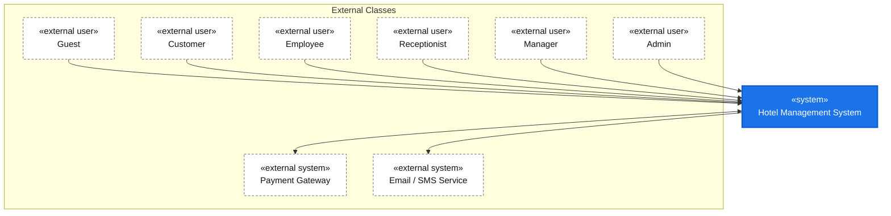
```mermaid
graph TB
    subgraph External["External Classes"]
        G["«external user»<br/>Guest"]
        C["«external user»<br/>Customer"]
        E["«external user»<br/>Employee"]
        R["«external user»<br/>Receptionist"]
        M["«external user»<br/>Manager"]
        A["«external user»<br/>Admin"]
        PG["«external system»<br/>Payment Gateway"]
        NS["«external system»<br/>Email / SMS Service"]
    end

    SYS["«system»<br/>Hotel Management System"]

    G --> SYS
    C --> SYS
    E --> SYS
    R --> SYS
    M --> SYS
    A --> SYS
    SYS <--> PG
    SYS --> NS

    classDef ext fill:#fff,stroke:#666,stroke-dasharray:4 3,color:#111
    classDef sys fill:#1a73e8,stroke:#0b57d0,color:#fff,stroke-width:2px
    class G,C,E,R,M,A,PG,NS ext
    class SYS sys
```

### 5.2 Entity Class Model — Conceptual Static Model

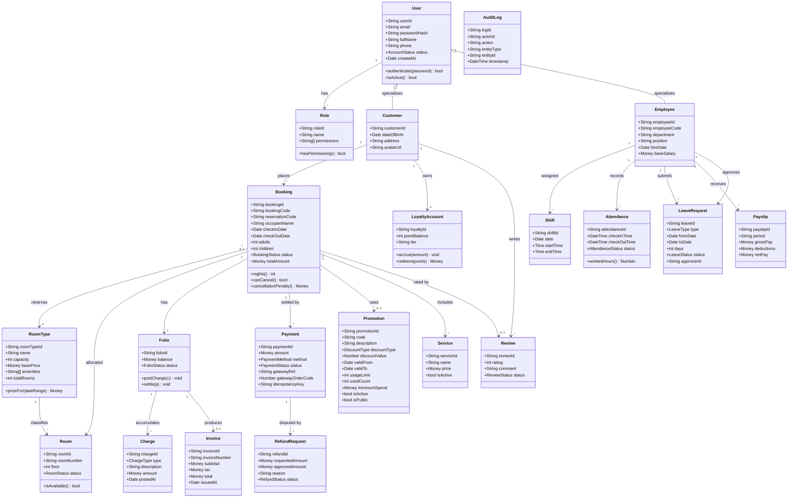
```mermaid
classDiagram
    class User {
        +String userId
        +String email
        +String passwordHash
        +String fullName
        +String phone
        +AccountStatus status
        +Date createdAt
        +authenticate(password) bool
        +isActive() bool
    }

    class Role {
        +String roleId
        +String name
        +String[] permissions
        +hasPermission(p) bool
    }

    class Customer {
        +String customerId
        +Date dateOfBirth
        +String address
        +String avatarUrl
    }

    class Employee {
        +String employeeId
        +String employeeCode
        +String department
        +String position
        +Date hireDate
        +Money baseSalary
    }

    class RoomType {
        +String roomTypeId
        +String name
        +int capacity
        +Money basePrice
        +String[] amenities
        +int totalRooms
        +priceFor(dateRange) Money
    }

    class Room {
        +String roomId
        +String roomNumber
        +int floor
        +RoomStatus status
        +isAvailable() bool
    }

    class Booking {
        +String bookingId
        +String bookingCode
        +String reservationCode
        +String occupantName
        +Date checkInDate
        +Date checkOutDate
        +int adults
        +int children
        +BookingStatus status
        +Money totalAmount
        +nights() int
        +canCancel() bool
        +cancellationPenalty() Money
    }

    class Folio {
        +String folioId
        +Money balance
        +FolioStatus status
        +postCharge(c) void
        +settle(p) void
    }

    class Charge {
        +String chargeId
        +ChargeType type
        +String description
        +Money amount
        +Date postedAt
    }

    class Payment {
        +String paymentId
        +Money amount
        +PaymentMethod method
        +PaymentStatus status
        +String gatewayRef
        +Number gatewayOrderCode
        +String idempotencyKey
    }

    class Invoice {
        +String invoiceId
        +String invoiceNumber
        +Money subtotal
        +Money tax
        +Money total
        +Date issuedAt
    }

    class RefundRequest {
        +String refundId
        +Money requestedAmount
        +Money approvedAmount
        +String reason
        +RefundStatus status
    }

    class Service {
        +String serviceId
        +String name
        +Money price
        +bool isActive
    }

    class Promotion {
        +String promotionId
        +String code
        +String description
        +DiscountType discountType
        +Number discountValue
        +Date validFrom
        +Date validTo
        +int usageLimit
        +int usedCount
        +Money minimumSpend
        +bool isActive
        +bool isPublic
    }

    class Review {
        +String reviewId
        +int rating
        +String comment
        +ReviewStatus status
    }

    class LoyaltyAccount {
        +String loyaltyId
        +int pointBalance
        +String tier
        +accrue(amount) void
        +redeem(points) Money
    }

    class Shift {
        +String shiftId
        +Date date
        +Time startTime
        +Time endTime
    }

    class Attendance {
        +String attendanceId
        +DateTime checkInTime
        +DateTime checkOutTime
        +AttendanceStatus status
        +workedHours() Number
    }

    class LeaveRequest {
        +String leaveId
        +LeaveType type
        +Date fromDate
        +Date toDate
        +int days
        +LeaveStatus status
        +String approverId
    }

    class Payslip {
        +String payslipId
        +String period
        +Money grossPay
        +Money deductions
        +Money netPay
    }

    class AuditLog {
        +String logId
        +String actorId
        +String action
        +String entityType
        +String entityId
        +DateTime timestamp
    }

    User "1" --> "*" Role : has
    User <|-- Customer : specializes
    User <|-- Employee : specializes
    Customer "1" --> "*" Booking : places
    Customer "1" --> "1" LoyaltyAccount : owns
    Customer "1" --> "*" Review : writes
    RoomType "1" --> "*" Room : classifies
    Booking "*" --> "1" RoomType : reserves
    Booking "0..1" --> "1" Room : allocated
    Booking "1" --> "1" Folio : has
    Booking "1" --> "*" Payment : settled by
    Booking "*" --> "0..1" Promotion : uses
    Booking "1" --> "*" Service : includes
    Booking "1" --> "0..1" Review : rated by
    Folio "1" --> "*" Charge : accumulates
    Folio "1" --> "0..1" Invoice : produces
    Payment "1" --> "*" RefundRequest : disputed by
    Employee "1" --> "*" Shift : assigned
    Employee "1" --> "*" Attendance : records
    Employee "1" --> "*" LeaveRequest : submits
    Employee "1" --> "*" Payslip : receives
    Employee "1" --> "*" LeaveRequest : approves
```

### 5.3 Key Entity Attributes and Invariants

| Entity | Key invariants |
|---|---|
| `Booking` | `checkOutDate > checkInDate`; `nights ≤ 30`; `adults ≥ 1` and `adults + children ≤ roomType.capacity`; status transitions only along `PENDING → CONFIRMED → CHECKED_IN → CHECKED_OUT`, with `CANCELLED` reachable only before `CHECKED_IN`. |
| Reservation (`reservationCode`) | 1 to 5 bookings (BR-08); every booking shares the dates and the booker; their payments share one payOS `gatewayOrderCode`, and the link amount equals the sum of the rooms. |
| `Room` | A room has at most one active stay at a time (BR-25); status ∈ {`VACANT_CLEAN`, `VACANT_DIRTY`, `OCCUPIED`, `OUT_OF_ORDER`, `INSPECTED`}. |
| `Payment` | `amount > 0`; immutable once `PAID`; `idempotencyKey` unique; `gatewayOrderCode` unique per payOS link but shared by the rooms of one reservation; corrections only by reversal (BR-33). |
| `Invoice` | `invoiceNumber` strictly sequential and gapless; immutable once issued (BR-30). |
| `RefundRequest` | `approvedAmount ≤ requestedAmount ≤ sum(payments.amount)` (BR-37). |
| `LeaveRequest` | `days ≤ leaveBalance` unless explicitly unpaid (BR-40); `approverId ≠ employeeId` (BR-44). |
| `LoyaltyAccount` | `pointBalance ≥ 0`; accrual only on `CHECKED_OUT` stays (BR-29). |
| `Promotion` | `code` matches `^[A-Z0-9]{4,20}$` and is unique; `0 < discountValue ≤ 100` for a percentage; `validTo > validFrom`; `usedCount` equals the paid reservations that used it; `discountType`/`discountValue` fixed once used (BR-52…BR-57). |
| `AuditLog` | Append-only; never updated or deleted (BR-49). |

### 5.4 Design Decision — A Reservation Is a Group of Room Bookings

Booking several rooms at once could be modelled as one `Booking` holding a list of rooms, or as
one `Booking` per room grouped by a shared code. HMS uses **one Booking per room**, grouped by
`reservationCode`:

| Concern | One Booking with a list of rooms | One Booking per room (chosen) |
|---|---|---|
| Rooms arriving or leaving at different times | Needs per-line state inside one document | Each room has its own lifecycle already (§6.4) |
| Cancelling one room of three | Partial-cancel logic, partial refunds | The existing per-room cancel and refund |
| Availability (UC-G01) | Must count lines, not documents | Unchanged — counts bookings |
| Room allocation, folio, invoice | Per line, all new | Unchanged — per booking |
| Paying once | Natural | One payOS link; one `Payment` per room sharing its `orderCode` |

The rejected alternative was, in effect, the original design: a `roomCount` field on a single
booking. That was defective — it held and charged for *n* rooms but consumed one room of
inventory and allocated one room at check-in. `Reservation` is not a separate entity class: it
has no state of its own beyond what its rooms carry, so it is represented by the shared code and
reconstructed by query.

---

## 6. Analysis Modeling — Object and Class Structuring (Ch. 8)

Per Ch. 8, each software object is categorized so that objects with similar characteristics are
grouped, giving a design in which responsibilities are clearly separated.

### 6.1 Object Structuring Categories

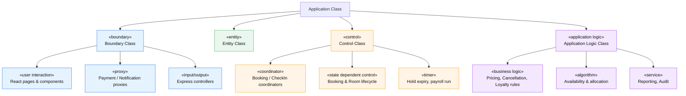
```mermaid
graph TB
    APP["Application Class"]
    APP --> BND["«boundary»<br/>Boundary Class"]
    APP --> ENT["«entity»<br/>Entity Class"]
    APP --> CTL["«control»<br/>Control Class"]
    APP --> LOG["«application logic»<br/>Application Logic Class"]

    BND --> UI["«user interaction»<br/>React pages & components"]
    BND --> PXY["«proxy»<br/>Payment / Notification proxies"]
    BND --> IO["«input/output»<br/>Express controllers"]

    CTL --> COORD["«coordinator»<br/>Booking / CheckIn coordinators"]
    CTL --> SD["«state dependent control»<br/>Booking & Room lifecycle"]
    CTL --> TMR["«timer»<br/>Hold expiry, payroll run"]

    LOG --> BL["«business logic»<br/>Pricing, Cancellation, Loyalty rules"]
    LOG --> ALG["«algorithm»<br/>Availability & allocation"]
    LOG --> SVC["«service»<br/>Reporting, Audit"]

    classDef b fill:#e5f3ff,stroke:#1a73e8,color:#111
    classDef e fill:#eaf7ee,stroke:#34a853,color:#111
    classDef c fill:#fff4e5,stroke:#f59e0b,color:#111
    classDef l fill:#f3e8fd,stroke:#a142f4,color:#111
    class BND,UI,PXY,IO b
    class ENT e
    class CTL,COORD,SD,TMR c
    class LOG,BL,ALG,SVC l
```

### 6.2 Object Allocation by Category

**«boundary» — User interaction objects (React)**

| Object | Responsibility | Realizes |
|---|---|---|
| `LoginPage` | Collect credentials, display errors | UC-G17 |
| `RegisterPage` | Collect registration data | UC-G16 |
| `RoomSearchPage` | Search criteria and result list | UC-G01 |
| `BookingWizardPage` | Multi-step booking flow | UC-G07 |
| `PaymentPage` | Method selection, gateway redirect | UC-G10 |
| `BookingDetailPage` | Detail, cancel, modify | UC-G13/14/15 |
| `FrontDeskPage` | Check-in / check-out console | UC-R06, UC-R09 |
| `RoomRackPage` | Room availability and status board | UC-R12, UC-R13 |
| `ApprovalQueuePage` | Manager pending approvals | UC-M06, UC-M14 |
| `PromotionsPage` | Promotion codes: list with usage, create, edit, switch on/off | UC-M11, UC-M19…M22 |
| `AccountAdminPage` | Accounts and role assignment | UC-A01, UC-A06 |

**«boundary» — I/O and proxy objects (Express)**

| Object | Responsibility |
|---|---|
| `AuthController` | HTTP boundary for authentication |
| `BookingController` | HTTP boundary for booking operations |
| `CheckInController` | HTTP boundary for front-desk operations |
| `PromotionController` | HTTP boundary for promotion codes and the public offers / preview |
| `PaymentGatewayProxy` | Encapsulates the external payment gateway protocol |
| `NotificationProxy` | Encapsulates the email/SMS provider protocol |

**«entity» — Entity objects (Mongoose models)**

`User`, `Role`, `Customer`, `Employee`, `RoomType`, `Room`, `Booking`, `Folio`, `Charge`,
`Payment`, `Invoice`, `RefundRequest`, `Service`, `Promotion`, `Review`, `LoyaltyAccount`,
`Shift`, `Attendance`, `LeaveRequest`, `Payslip`, `AuditLog`.

**«control» — Control objects**

| Object | Kind | Coordinates |
|---|---|---|
| `BookingCoordinator` | coordinator | UC-G07: availability → contact → add-ons → payment → confirm |
| `CheckInCoordinator` | coordinator | UC-R06: verify → allocate → collect → activate |
| `CheckOutCoordinator` | coordinator | UC-R09: consolidate → invoice → settle → release |
| `RefundCoordinator` | coordinator | UC-C17 + UC-M14 approval chain |
| `PromotionService` | coordinator | UC-M11: validate → check uniqueness / locks → conditional write → audit; the one entry point for UC-G06, UC-G11 and UC-G07 step 8 |
| `BookingStateMachine` | state dependent | `Booking` lifecycle transitions |
| `RoomStateMachine` | state dependent | `Room` status transitions |
| `HoldExpiryTimer` | timer | Releases inventory holds after 15 min (BR-10) |
| `PayrollRunTimer` | timer | Triggers the monthly payroll run |

**«application logic» — Business logic and algorithm objects**

| Object | Kind | Encapsulated rule |
|---|---|---|
| `PricingRule` | business logic | Nightly seasonal rate, taxes, totals (BR-09) |
| `CancellationPolicyRule` | business logic | Penalty tiers (BR-17…BR-19) |
| `LoyaltyRule` | business logic | Accrual and redemption (BR-12, BR-29) |
| `PromotionRule` | business logic | Code status, whether a code applies (incl. minimum spend), valid terms, locked terms (BR-52…BR-57) |
| `LeavePolicyRule` | business logic | Balance, coverage, blackout (BR-40…BR-44) |
| `AvailabilityCalculator` | algorithm | Availability over a date range |
| `RoomAllocator` | algorithm | Race-free selection of a vacant-clean room (BR-25) |
| `InvoiceNumberGenerator` | algorithm | Gapless sequential numbering (BR-30) |
| `ReportingService` | service | Revenue, occupancy, ADR, RevPAR |
| `AuditService` | service | Append-only audit trail (BR-49) |

### 6.3 Object Interaction — UC-G07 Book Room

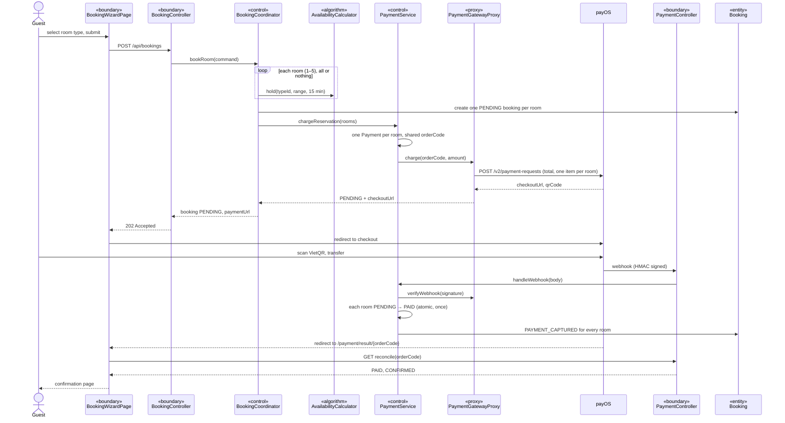
```mermaid
sequenceDiagram
    actor G as Guest
    participant UI as «boundary»<br/>BookingWizardPage
    participant BC as «boundary»<br/>BookingController
    participant CO as «control»<br/>BookingCoordinator
    participant AV as «algorithm»<br/>AvailabilityCalculator
    participant PS as «control»<br/>PaymentService
    participant PG as «proxy»<br/>PaymentGatewayProxy
    participant PO as payOS
    participant PC as «boundary»<br/>PaymentController
    participant BK as «entity»<br/>Booking

    G->>UI: select room type, submit
    UI->>BC: POST /api/bookings
    BC->>CO: bookRoom(command)
    loop each room (1–5), all or nothing
        CO->>AV: hold(typeId, range, 15 min)
    end
    CO->>BK: create one PENDING booking per room
    CO->>PS: chargeReservation(rooms)
    PS->>PS: one Payment per room, shared orderCode
    PS->>PG: charge(orderCode, amount)
    PG->>PO: POST /v2/payment-requests (total, one item per room)
    PO-->>PG: checkoutUrl, qrCode
    PG-->>CO: PENDING + checkoutUrl
    CO-->>BC: booking PENDING, paymentUrl
    BC-->>UI: 202 Accepted
    UI->>PO: redirect to checkout
    G->>PO: scan VietQR, transfer
    PO->>PC: webhook (HMAC signed)
    PC->>PS: handleWebhook(body)
    PS->>PG: verifyWebhook(signature)
    PS->>PS: each room PENDING → PAID (atomic, once)
    PS->>BK: PAYMENT_CAPTURED for every room
    PO-->>UI: redirect to /payment/result/{orderCode}
    UI->>PC: GET reconcile(orderCode)
    PC-->>UI: PAID, CONFIRMED
    UI-->>G: confirmation page
```

### 6.4 State-Dependent Control — Booking Lifecycle

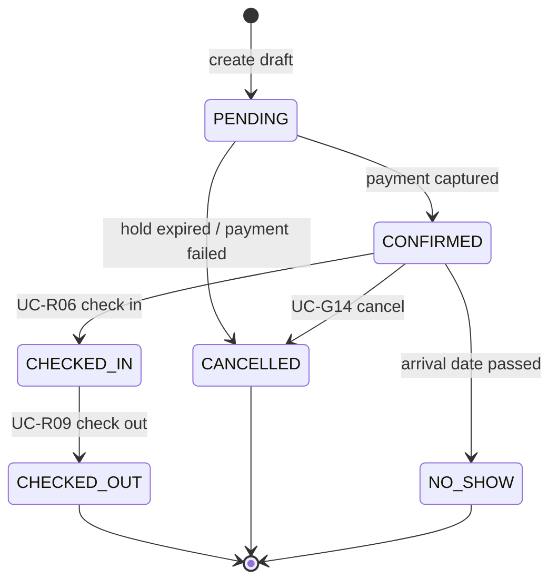
```mermaid
stateDiagram-v2
    [*] --> PENDING : create draft
    PENDING --> CONFIRMED : payment captured
    PENDING --> CANCELLED : hold expired / payment failed
    CONFIRMED --> CHECKED_IN : UC-R06 check in
    CONFIRMED --> CANCELLED : UC-G14 cancel
    CONFIRMED --> NO_SHOW : arrival date passed
    CHECKED_IN --> CHECKED_OUT : UC-R09 check out
    CHECKED_OUT --> [*]
    CANCELLED --> [*]
    NO_SHOW --> [*]
```

### 6.5 State-Dependent Control — Room Lifecycle

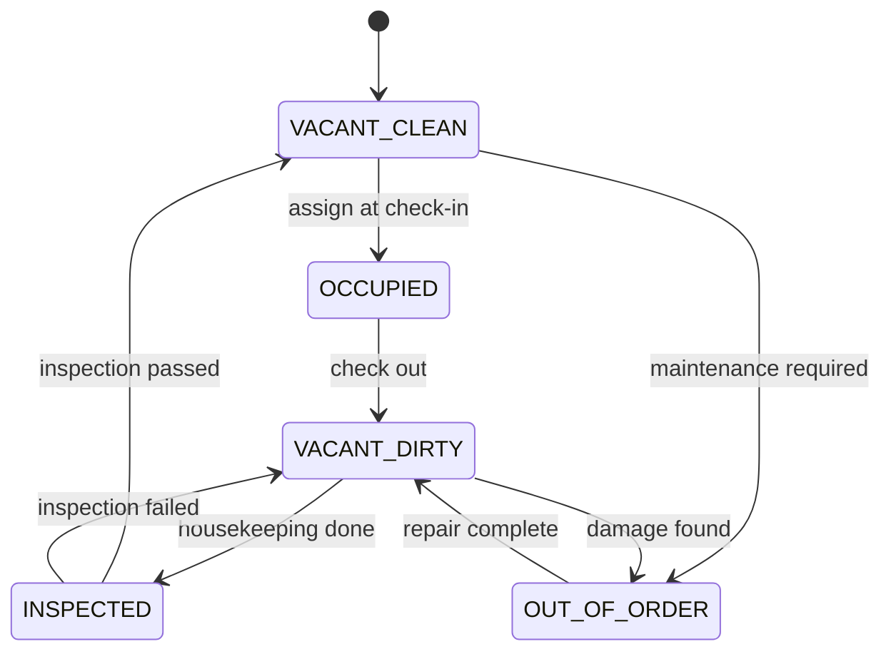
```mermaid
stateDiagram-v2
    [*] --> VACANT_CLEAN
    VACANT_CLEAN --> OCCUPIED : assign at check-in
    OCCUPIED --> VACANT_DIRTY : check out
    VACANT_DIRTY --> INSPECTED : housekeeping done
    INSPECTED --> VACANT_CLEAN : inspection passed
    INSPECTED --> VACANT_DIRTY : inspection failed
    VACANT_CLEAN --> OUT_OF_ORDER : maintenance required
    VACANT_DIRTY --> OUT_OF_ORDER : damage found
    OUT_OF_ORDER --> VACANT_DIRTY : repair complete
```

---

## 7. Overall Software Architecture

### 7.1 Architectural Style

HMS uses a **layered client-server architecture** with a React single-page client and an
Express REST service. The server is internally organized into four layers that map directly onto
the Ch. 8 object categories.

| Layer | Ch. 8 category | Contents |
|---|---|---|
| Presentation | «boundary» user interaction | React pages, components, hooks |
| API / Boundary | «boundary» I/O, «proxy» | Express routes, controllers, external proxies |
| Business | «control», «application logic» | Coordinators, state machines, rules, algorithms |
| Data | «entity» | Mongoose models and repositories |

### 7.2 Layered Architecture Diagram

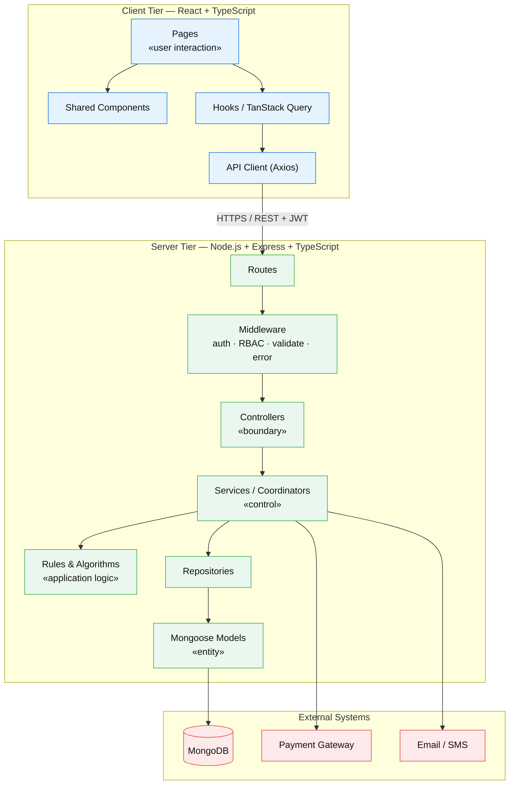
```mermaid
graph TB
    subgraph CL["Client Tier — React + TypeScript"]
        P["Pages<br/>«user interaction»"]
        CMP["Shared Components"]
        HK["Hooks / TanStack Query"]
        AC["API Client (Axios)"]
        P --> CMP
        P --> HK
        HK --> AC
    end

    subgraph SRV["Server Tier — Node.js + Express + TypeScript"]
        RT["Routes"]
        MW["Middleware<br/>auth · RBAC · validate · error"]
        CTRL["Controllers<br/>«boundary»"]
        SVC["Services / Coordinators<br/>«control»"]
        RULE["Rules & Algorithms<br/>«application logic»"]
        REPO["Repositories"]
        MDL["Mongoose Models<br/>«entity»"]
        RT --> MW --> CTRL --> SVC
        SVC --> RULE
        SVC --> REPO --> MDL
    end

    subgraph EXT["External Systems"]
        DB[("MongoDB")]
        PG["Payment Gateway"]
        NS["Email / SMS"]
    end

    AC -->|HTTPS / REST + JWT| RT
    MDL --> DB
    SVC --> PG
    SVC --> NS

    classDef c fill:#e5f3ff,stroke:#1a73e8,color:#111
    classDef s fill:#eaf7ee,stroke:#34a853,color:#111
    classDef e fill:#fdeaea,stroke:#ea4335,color:#111
    class P,CMP,HK,AC c
    class RT,MW,CTRL,SVC,RULE,REPO,MDL s
    class DB,PG,NS e
```

### 7.3 Subsystem Decomposition

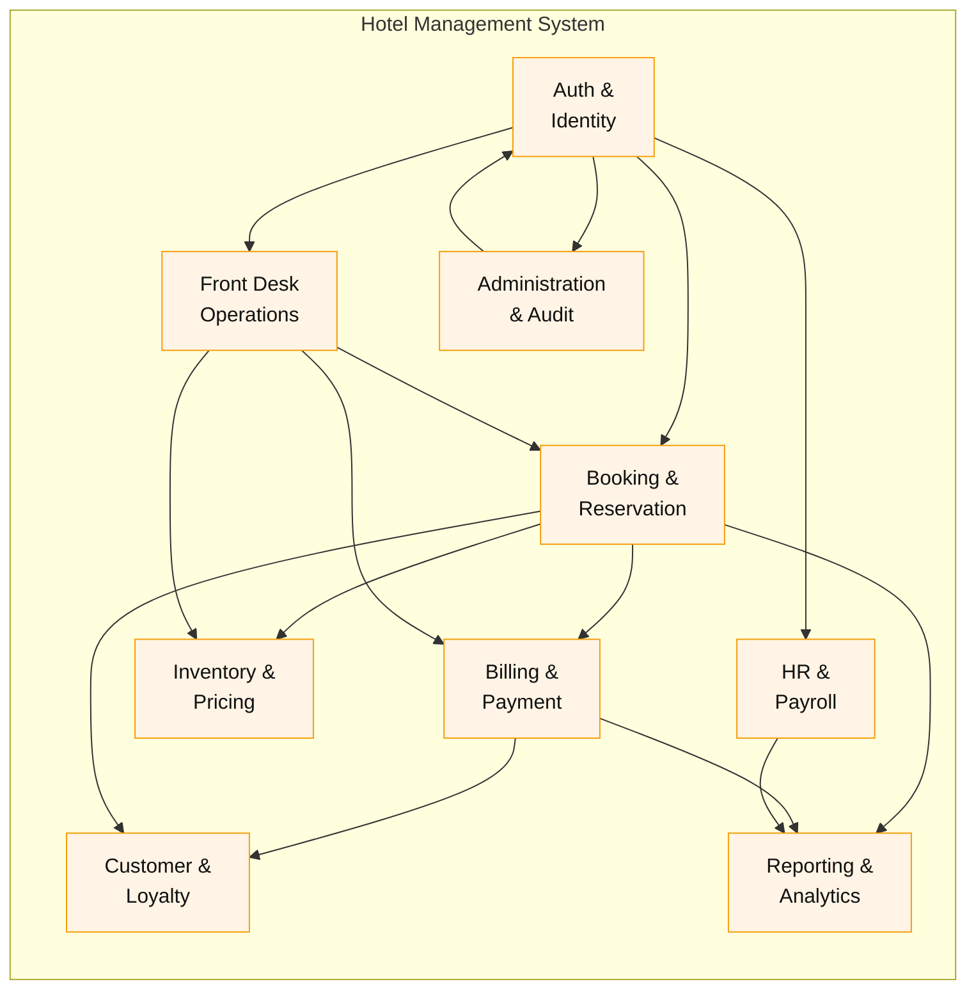
```mermaid
graph LR
    subgraph HMS["Hotel Management System"]
        AUTH["Auth &<br/>Identity"]
        BOOK["Booking &<br/>Reservation"]
        FD["Front Desk<br/>Operations"]
        BILL["Billing &<br/>Payment"]
        INV["Inventory &<br/>Pricing"]
        HR["HR &<br/>Payroll"]
        CRM["Customer &<br/>Loyalty"]
        RPT["Reporting &<br/>Analytics"]
        ADM["Administration<br/>& Audit"]
    end

    AUTH --> BOOK
    AUTH --> FD
    AUTH --> HR
    AUTH --> ADM
    BOOK --> INV
    BOOK --> BILL
    FD --> BOOK
    FD --> BILL
    FD --> INV
    BILL --> CRM
    BOOK --> CRM
    BOOK --> RPT
    BILL --> RPT
    HR --> RPT
    ADM --> AUTH

    classDef s fill:#fff4e5,stroke:#f59e0b,color:#111
    class AUTH,BOOK,FD,BILL,INV,HR,CRM,RPT,ADM s
```

| Subsystem | Responsibility | Principal use cases |
|---|---|---|
| Auth & Identity | Authentication, session, RBAC enforcement | UC-G16, UC-G17, UC-C01…C05, UC-A06 |
| Booking & Reservation | Search, book, modify, cancel | UC-G01, UC-G07, UC-G13…G15, UC-R03…R05 |
| Front Desk Operations | Check-in/out, room status, folio | UC-R06…R14, UC-R19 |
| Billing & Payment | Payments, invoices, refunds | UC-G10, UC-R15…R18, UC-C17, UC-M14 |
| Inventory & Pricing | Rooms, room types, rates, promotion codes | UC-M09…M12, UC-M19…M22, UC-G06, UC-G11 |
| HR & Payroll | Attendance, shifts, leave, payroll | UC-E09…E24, UC-M01…M08b |
| Customer & Loyalty | Profile, reviews, points | UC-C06…C21, UC-M15 |
| Reporting & Analytics | Revenue, occupancy, exports | UC-M16…M18 |
| Administration & Audit | Accounts, roles, settings, audit, backup | UC-A01…A18 |

### 7.4 Package Diagram

The package diagram shows how the source code is physically organized and, more
importantly, the permitted dependency directions between packages. Every
dependency points **downward**: a package may only depend on packages in the
layers below it. This acyclic, one-directional structure is what makes the
system modifiable and testable (§8.1) — a change in a lower layer never forces a
change in a higher one, and a lower layer can be unit-tested without the layers
above it.

#### 7.4.1 Top-Level Package Structure

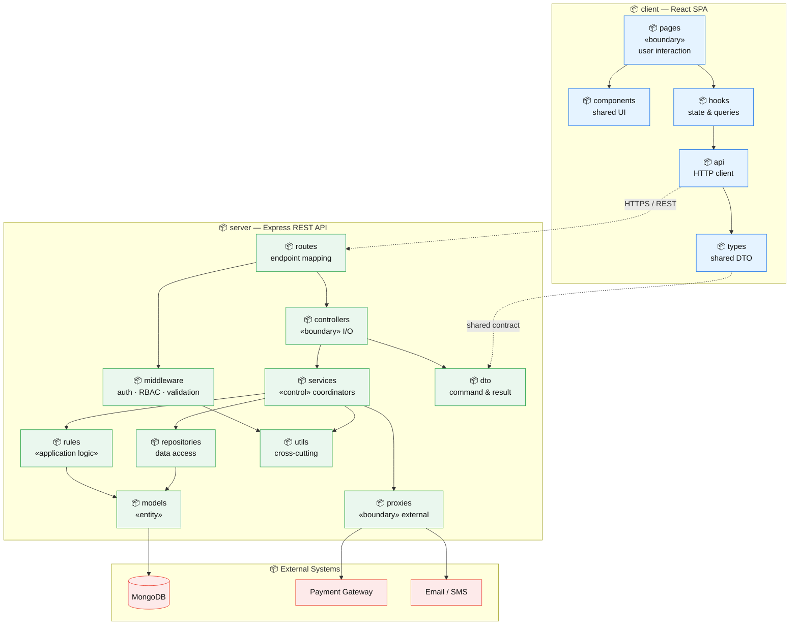
```mermaid
graph TB
    subgraph client["📦 client — React SPA"]
        cPages["📦 pages<br/>«boundary»<br/>user interaction"]
        cComp["📦 components<br/>shared UI"]
        cHooks["📦 hooks<br/>state &amp; queries"]
        cApi["📦 api<br/>HTTP client"]
        cTypes["📦 types<br/>shared DTO"]
    end

    subgraph server["📦 server — Express REST API"]
        sRoutes["📦 routes<br/>endpoint mapping"]
        sMw["📦 middleware<br/>auth · RBAC · validation"]
        sCtrl["📦 controllers<br/>«boundary» I/O"]
        sSvc["📦 services<br/>«control» coordinators"]
        sRules["📦 rules<br/>«application logic»"]
        sProxy["📦 proxies<br/>«boundary» external"]
        sRepo["📦 repositories<br/>data access"]
        sModels["📦 models<br/>«entity»"]
        sDto["📦 dto<br/>command &amp; result"]
        sUtils["📦 utils<br/>cross-cutting"]
    end

    subgraph ext["📦 External Systems"]
        eDb[("MongoDB")]
        ePg["Payment Gateway"]
        eNs["Email / SMS"]
    end

    cPages --> cComp
    cPages --> cHooks
    cHooks --> cApi
    cApi --> cTypes
    cApi -.->|HTTPS / REST| sRoutes

    sRoutes --> sMw
    sRoutes --> sCtrl
    sCtrl --> sSvc
    sCtrl --> sDto
    sSvc --> sRules
    sSvc --> sRepo
    sSvc --> sProxy
    sRules --> sModels
    sRepo --> sModels
    sMw --> sUtils
    sSvc --> sUtils

    sModels --> eDb
    sProxy --> ePg
    sProxy --> eNs
    cTypes -.->|shared contract| sDto

    classDef cl fill:#e5f3ff,stroke:#1a73e8,color:#111
    classDef sv fill:#eaf7ee,stroke:#34a853,color:#111
    classDef ex fill:#fdeaea,stroke:#ea4335,color:#111
    class cPages,cComp,cHooks,cApi,cTypes cl
    class sRoutes,sMw,sCtrl,sSvc,sRules,sProxy,sRepo,sModels,sDto,sUtils sv
    class eDb,ePg,eNs ex
```

#### 7.4.2 Layered Package Dependencies

Collapsing the packages onto the four architectural layers makes the dependency
rule explicit. Note that `rules` and `models` never depend on anything above
them — this is why the «application logic» objects are pure and directly
unit-testable.

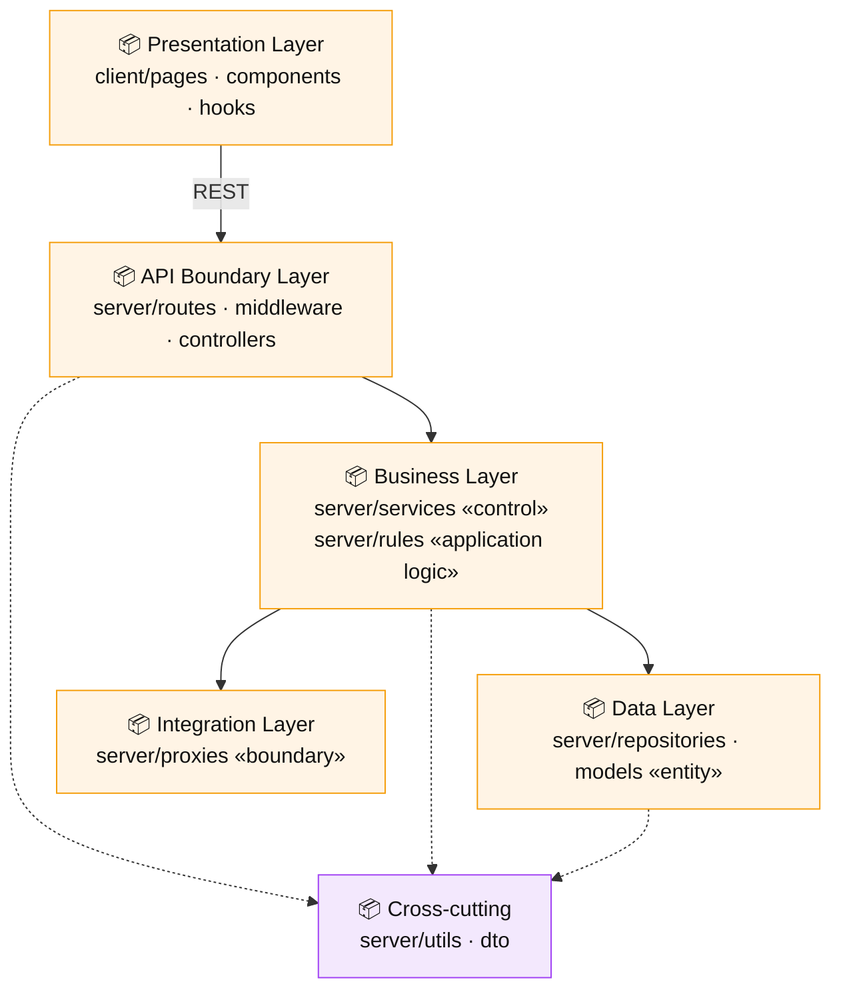
```mermaid
graph TB
    L1["📦 Presentation Layer<br/>client/pages · components · hooks"]
    L2["📦 API Boundary Layer<br/>server/routes · middleware · controllers"]
    L3["📦 Business Layer<br/>server/services «control»<br/>server/rules «application logic»"]
    L4["📦 Data Layer<br/>server/repositories · models «entity»"]
    L5["📦 Integration Layer<br/>server/proxies «boundary»"]
    LX["📦 Cross-cutting<br/>server/utils · dto"]

    L1 -->|REST| L2
    L2 --> L3
    L3 --> L4
    L3 --> L5
    L2 -.-> LX
    L3 -.-> LX
    L4 -.-> LX

    classDef l fill:#fff4e5,stroke:#f59e0b,color:#111
    classDef x fill:#f3e8fd,stroke:#a142f4,color:#111
    class L1,L2,L3,L4,L5 l
    class LX x
```

#### 7.4.3 Business Subsystem Packages

Within the business layer, the services are grouped by the subsystems of §7.3.
Subsystem packages depend on shared rule packages but never on each other's
internals — they collaborate only through the coordinators.

```mermaid
graph TB
    subgraph svc["📦 server/services — «control»"]
        pAuth["📦 auth<br/>AuthService"]
        pBook["📦 booking<br/>BookingCoordinator"]
        pFront["📦 frontdesk<br/>CheckIn/CheckOutCoordinator"]
        pBill["📦 billing<br/>PaymentService · RefundCoordinator"]
        pHr["📦 hr<br/>LeaveApprovalService"]
        pAdmin["📦 admin<br/>RoleAssignmentService · AuditService"]
        pRpt["📦 reporting<br/>ReportingService"]
        pPrice["📦 pricing<br/>PromotionService"]
    end

    subgraph rules["📦 server/rules — «application logic»"]
        rPrice["PricingRule"]
        rCancel["CancellationPolicyRule"]
        rAvail["AvailabilityCalculator"]
        rAlloc["RoomAllocator"]
        rLeave["LeavePolicyRule"]
        rState["Booking/RoomStateMachine"]
        rInv["InvoiceNumberGenerator"]
        rPromo["PromotionRule"]
    end

    pBook --> rPrice
    pBook --> rCancel
    pBook --> rAvail
    pBook --> rState
    pBook --> pBill
    pFront --> rAlloc
    pFront --> rState
    pFront --> rInv
    pFront --> pBill
    pBill --> rCancel
    pHr --> rLeave
    pAuth --> pAdmin
    pBook --> pAdmin
    pFront --> pAdmin
    pBill --> pAdmin
    pBook --> pPrice
    pPrice --> rPromo
    pPrice --> rPrice
    pPrice --> pAdmin

    classDef s fill:#eaf7ee,stroke:#34a853,color:#111
    classDef r fill:#f3e8fd,stroke:#a142f4,color:#111
    class pAuth,pBook,pFront,pBill,pHr,pAdmin,pRpt,pPrice s
    class rPrice,rCancel,rAvail,rAlloc,rLeave,rState,rInv,rPromo r
```

#### 7.4.4 Package Responsibilities and Dependency Rules

| Package | Ch. 8 category | May depend on | Must NOT depend on |
|---|---|---|---|
| `client/pages` | «boundary» user interaction | `components`, `hooks`, `types` | server internals |
| `client/hooks` | — | `api`, `types` | `pages` |
| `client/api` | «boundary» I/O | `types` | `pages`, `hooks` |
| `server/routes` | — | `controllers`, `middleware` | `services`, `models` |
| `server/middleware` | «boundary» | `utils`, `models` (auth only) | `controllers`, `services` |
| `server/controllers` | «boundary» I/O | `services`, `dto`, `utils` | `models`, `repositories` |
| `server/services` | «control» | `rules`, `repositories`, `proxies`, `dto`, `utils` | `controllers`, `routes` |
| `server/rules` | «application logic» | `models`, `utils` | `services`, `repositories`, `proxies` |
| `server/repositories` | — | `models` | `services`, `controllers` |
| `server/models` | «entity» | `utils` | everything above |
| `server/proxies` | «boundary» external | `utils`, `dto` | `services`, `models` |
| `server/utils`, `dto` | cross-cutting | — | everything |

**Why controllers must not reach `models` directly.** If a controller queried a
Mongoose model itself, business logic would leak into the HTTP boundary and the
same rule would end up duplicated in every endpoint that needed it. Routing all
data access through `services` keeps each business rule in exactly one place —
this is the Ch. 20 Modifiability argument, and it is what makes the traceability
matrix in §9 possible.

**Why `rules` must not depend on `repositories`.** The «application logic»
objects are pure functions of their inputs. `PricingRule.calculate()` receives a
room type and returns a breakdown; it never loads anything. That is what allows
them to be unit-tested with plain object literals and no database, satisfying
§8.1 Testability.

### 7.5 Deployment Architecture

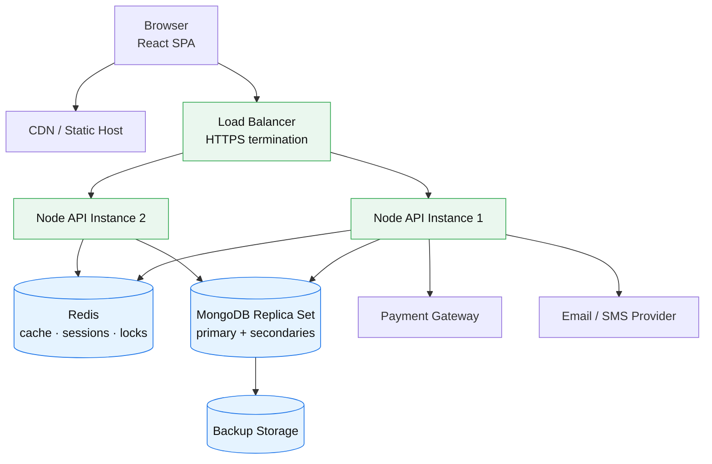
```mermaid
graph TB
    B["Browser<br/>React SPA"]
    CDN["CDN / Static Host"]
    LB["Load Balancer<br/>HTTPS termination"]
    N1["Node API Instance 1"]
    N2["Node API Instance 2"]
    RD[("Redis<br/>cache · sessions · locks")]
    MG[("MongoDB Replica Set<br/>primary + secondaries")]
    BK[("Backup Storage")]
    PG["Payment Gateway"]
    NS["Email / SMS Provider"]

    B --> CDN
    B --> LB
    LB --> N1
    LB --> N2
    N1 --> RD
    N2 --> RD
    N1 --> MG
    N2 --> MG
    MG --> BK
    N1 --> PG
    N1 --> NS

    classDef n fill:#eaf7ee,stroke:#34a853,color:#111
    classDef d fill:#e5f3ff,stroke:#1a73e8,color:#111
    class N1,N2,LB n
    class RD,MG,BK d
```

### 7.6 API Surface (representative)

| Method | Endpoint | Use case | Roles |
|---|---|---|---|
| POST | `/api/auth/register` | UC-G16 | public |
| POST | `/api/auth/login` | UC-G17 | public |
| POST | `/api/auth/refresh` | UC-C02 | authenticated |
| POST | `/api/auth/forgot-password` | UC-C03 | public |
| GET | `/api/rooms/search` | UC-G01 | public |
| GET | `/api/room-types/:id` | UC-G02 | public |
| POST | `/api/bookings` — body `rooms: [{roomTypeId, adults, children, occupantName?}]` | UC-G07 | public / customer |
| POST | `/api/payments/payos/webhook` | UC-G10 step 7–9 | payOS (HMAC-signed, no JWT) |
| GET | `/api/payments/payos/:orderCode/reconcile` | UC-G10 alt. 1.1 | public (returns statuses only) |
| POST | `/api/payments/payos/confirm-webhook` | UC-A12 | admin (`MANAGE_SETTINGS`) |
| GET | `/api/bookings/lookup` — reservation or room code + email, returns every room | UC-G13 | public |
| POST | `/api/bookings/:id/cancel` | UC-G14 | customer / receptionist |
| GET | `/api/me/bookings` | UC-C11 | customer |
| POST | `/api/refund-requests` | UC-C17 | customer |
| POST | `/api/front-desk/check-in` | UC-R06 | receptionist |
| POST | `/api/front-desk/check-out` | UC-R09 | receptionist |
| POST | `/api/folios/:id/payments` | UC-R15 | receptionist |
| GET | `/api/rooms/availability` | UC-R12 | receptionist |
| PATCH | `/api/rooms/:id/status` | UC-R13 | receptionist |
| PATCH | `/api/leave-requests/:id/decision` | UC-M06 | manager |
| PATCH | `/api/refund-requests/:id/decision` | UC-M14 | manager |
| GET | `/api/promotions/public` | UC-G06 | public (public codes only, never usage) |
| GET | `/api/promotions/validate?code=&subtotal=` | UC-G11 | public (preview; the booking re-checks) |
| GET | `/api/promotions` | UC-M11 + UC-M19 | manager (`MANAGE_PRICING`) |
| POST | `/api/promotions` | UC-M20 | manager (`MANAGE_PRICING`) |
| PATCH | `/api/promotions/:id` | UC-M21 | manager (`MANAGE_PRICING`) |
| PATCH | `/api/promotions/:id/status` | UC-M22 | manager (`MANAGE_PRICING`) |
| DELETE | `/api/promotions/:id` | UC-M11 alt. 1.3 (unused codes only) | manager (`MANAGE_PRICING`) |
| GET | `/api/reports/revenue` | UC-M16 | manager |
| POST | `/api/accounts/:id/roles` | UC-A06 | admin |
| GET | `/api/audit-logs` | UC-A13 | admin |

---

## 8. Software Quality Attributes (Ch. 20)

### 8.1 Attributes and How They Are Achieved

| Attribute | Design decision in HMS |
|---|---|
| **Maintainability** | Four-layer separation; each Ch. 8 object category lives in its own directory; business rules isolated from entity data so a policy change touches one rule object. |
| **Modifiability** | Each external interface is encapsulated in its own proxy (`PaymentGatewayProxy`, `NotificationProxy`), so swapping the gateway changes one class. Each finite state machine (`BookingStateMachine`, `RoomStateMachine`) is a separate class. Each data structure sits behind a repository. |
| **Testability** | Controllers hold no logic; coordinators depend on injected repositories and rules, so they are unit-testable without a database. Rule objects are pure functions of their inputs. |
| **Traceability** | Every use case ID (UC-xxx) appears in the header comment of the realizing controller, service and route, and in the traceability matrix in §9. Every business rule (BR-xx) is named in the rule object that enforces it. |
| **Scalability** | Stateless API instances behind a load balancer; sessions in Redis rather than in process memory; read-heavy availability queries cached; MongoDB replica set for read scaling. |
| **Performance** | Search ≤ 2 s with a 60 s availability cache; indexes on `booking.checkInDate`, `booking.bookingCode`, `room.status`; integer minor units avoid floating-point cost and error. |
| **Availability** | Replica set with automatic failover; degraded offline mode for front-desk check-in with later reconciliation; retry queues for notification and refund failures. |
| **Security** | bcrypt password hashing; short-lived JWT with refresh rotation; RBAC middleware on every protected route; account lockout after 5 failures; card data never stored (gateway holds PCI scope); append-only audit log; segregation-of-duties checks on role assignment. |
| **Reusability** | Rule and algorithm objects (`PricingRule`, `AvailabilityCalculator`) are free of HTTP and database concerns and are reused by the public booking flow and the front-desk flow alike. |

### 8.2 Quality Attribute Scenarios

| # | Attribute | Stimulus | Response measure |
|---|---|---|---|
| QA-1 | Performance | 500 concurrent room searches | 95th percentile ≤ 2 s |
| QA-2 | Scalability | Traffic doubles in peak season | Add API instances; no code change |
| QA-3 | Availability | Primary database node fails | Failover ≤ 30 s; no committed booking lost |
| QA-4 | Security | 5 consecutive failed logins | Account locked, owner notified, event audited |
| QA-5 | Modifiability | Payment gateway is replaced | The wire protocol changes only `PaymentGatewayProxy`. *Measured when replacing the generic gateway with payOS:* endpoints, headers, both signature algorithms and status codes stayed inside the proxy. But payOS is **asynchronous** (redirect + webhook) where the original design assumed a synchronous charge, and that change of **interaction style** also touched `PaymentService` (orderCode, reconcile), one new controller/route, two `Payment` fields and a client result page. Lesson: a proxy isolates a *protocol*, not an *interaction model* — the sync-vs-async decision belongs in the architecture, not the adapter. |
| QA-6 | Reliability | Gateway times out mid-payment, or its webhook and the returning guest confirm the same payment concurrently | Payment is booked exactly once: the payOS `orderCode` prevents a second link, and the `PENDING → PAID` change is a conditional atomic update (10 concurrent confirmations → 1 capture; without the guard → 10) |
| QA-7 | Integrity | Two receptionists allocate the same room | Optimistic lock rejects the second; BR-25 holds |
| QA-8 | Traceability | Auditor asks who granted a role | Audit log returns actor, target, role, timestamp |

---

## 9. Traceability Matrix

Requirements traceability per Ch. 20: every detailed use case traces forward to the classes that
realize it and to the code artifacts that implement it.

| Use Case | «boundary» | «control» | «application logic» | «entity» | Code artifact |
|---|---|---|---|---|---|
| UC-G17 Login | `LoginPage`, `AuthController` | `AuthService` | — | `User`, `Role`, `AuditLog` | `LoginPage.tsx`, `auth.controller.ts`, `auth.service.ts` |
| UC-G16 Register | `RegisterPage`†, `AuthController` | `AuthService` | — | `User`, `Customer`, `LoyaltyAccount` | `auth.controller.ts`, `auth.service.ts` |
| UC-G01 Search Rooms | `RoomSearchPage`, `RoomController` | — (read-only, see note 1) | `AvailabilityCalculator`, `PricingRule` | `RoomType`, `Room`, `Booking` | `RoomSearchPage.tsx`, `booking.controller.ts`, `availability.calculator.ts`, `pricing.rule.ts` |
| UC-G07 Book Room | `BookingWizardPage`, `BookingController` | `BookingCoordinator`, `BookingStateMachine` | `PricingRule`, `AvailabilityCalculator` | `Booking`, `InventoryHold`, `Promotion`, `Payment` | `BookingWizardPage.tsx`, `booking.service.ts`, `booking-state-machine.ts` |
| UC-G10 Pay Booking | `BookingWizardPage` (step 3), `PaymentResultPage`, `PaymentController`, `PaymentGatewayProxy` (payOS) | `PaymentService` | — | `Payment`, `Booking`, `InventoryHold` | `payment.controller.ts`, `payment.service.ts`, `payment-gateway.proxy.ts`, `PaymentResultPage.tsx` |
| UC-G14 Cancel Booking | `MyBookingsPage`, `BookingController` | `BookingCoordinator`, `BookingStateMachine` | `CancellationPolicyRule` | `Booking`, `RefundRequest`, `Payment` | `MyBookingsPage.tsx`, `booking.service.ts`, `cancellation-policy.rule.ts` |
| UC-R06 Check In | `FrontDeskPage`, `FrontDeskController` | `CheckInCoordinator` | `RoomAllocator`, `FolioLedger` | `Booking`, `Room`, `Folio`, `Charge` | `FrontDeskPage.tsx`, `frontdesk.controller.ts`, `check-in.service.ts`, `room-allocator.ts` |
| UC-R09 Check Out | `FrontDeskPage`, `FrontDeskController` | `CheckOutCoordinator` | `InvoiceNumberGenerator`, `FolioLedger` | `Folio`, `Invoice`, `Room`, `LoyaltyAccount` | `check-in.service.ts`, `invoice-number.generator.ts` |
| UC-R15 Process Payment | `FrontDeskPage`, `FrontDeskController` | `PaymentService` | — | `Payment`, `Folio`, `DrawerSession` | `frontdesk.controller.ts`, `payment.service.ts` |
| UC-C17 Request Refund | `MyBookingsPage`, `RefundController` | `RefundCoordinator` | — | `RefundRequest`, `Payment` | `workflow.controller.ts`, `refund.service.ts` |
| UC-M06 Approve Leave | `ApprovalQueuePage`, `LeaveController` | `LeaveApprovalService` | `LeavePolicyRule` | `LeaveRequest`, `Employee`, `Shift` | `ApprovalQueuePage.tsx`, `leave.service.ts`, `leave-policy.rule.ts` |
| UC-A06 Assign Role | `AccountAdminPage`†, `AccountController` | `RoleAssignmentService` | `AuditService` | `User`, `Role`, `AuditLog` | `workflow.controller.ts`, `role.service.ts` |
| UC-M11 Manage Promotion Codes (+ M19…M22) | `PromotionsPage`, `PromotionController` | `PromotionService` | `PromotionRule`, `PricingRule`, `AuditService` | `Promotion`, `Booking`, `AuditLog` | `PromotionsPage.tsx`, `promotion.controller.ts`, `promotion.service.ts`, `promotion.rule.ts` |

† Designed in §6.2 but not yet implemented in the client boilerplate; the server endpoint exists and is exercised by the API.

**Analysis → implementation notes.** Ch. 8 lets analysis objects be merged or
refined during design; where that happened, the table above shows the
implemented name.

1. **UC-G01 has no control object.** It is read-only, and Ch. 8 notes that simple
   use cases do not need one; `RoomController` calls the two rule objects directly.
2. **`CheckInController` / `CheckOutController` / `PaymentController`** were merged
   into one `FrontDeskController`, since all three serve the same desk screen.
3. **`HoldExpiryTimer`** is realized as a MongoDB TTL index on `InventoryHold`
   (`expires: 0` on `expiresAt`) — the database is the timer.
4. **`PromotionRule`** decides whether a code applies and whether its terms are
   valid; `PricingRule.discountFor()` computes the amount. `PromotionService` is
   the single entry point used by the Manager's screen, the guest's preview and
   `BookingCoordinator`. **`LoyaltyRule`** is inline in
   `CheckOutCoordinator` (1 % of room revenue, BR-12/BR-29).
5. **`FolioLedger`** was added during implementation: the single entry point for
   posting a charge, which writes the VAT line with it so the folio balance is
   always tax-inclusive (see UC-R09, BR-28).

---

## Appendix A — Source Artifacts

| Artifact | Location |
|---|---|
| Use case diagrams | `diagrams/{Guest,Customer,Employee,Receptionist,Manager,Admin}.drawio` |
| Package diagram | `diagrams/package_diagram.drawio` |
| Boilerplate code | `System Design and Overall Architecture/src/` |
| Course material | `material/Ch05–Ch08`, `material/Ch20` |
